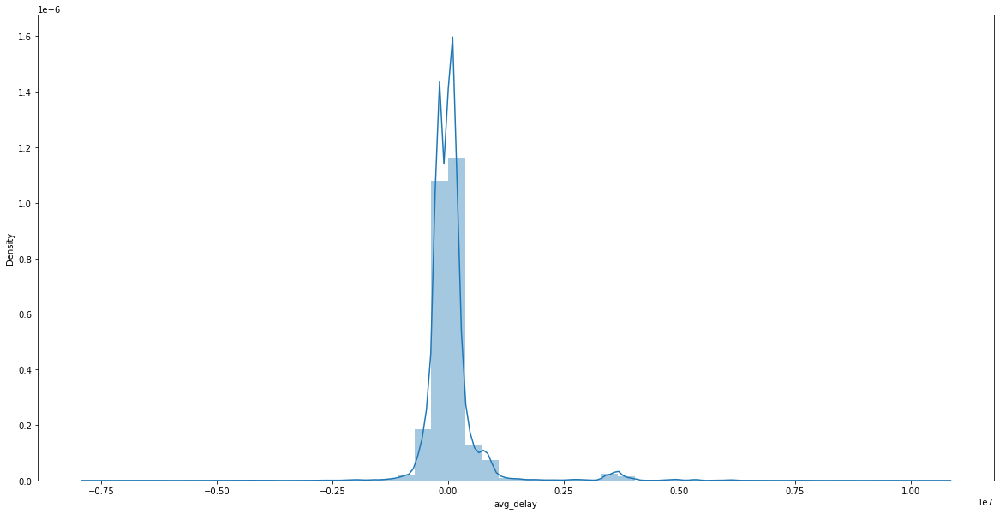
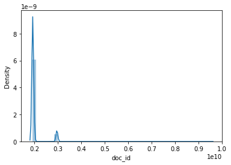
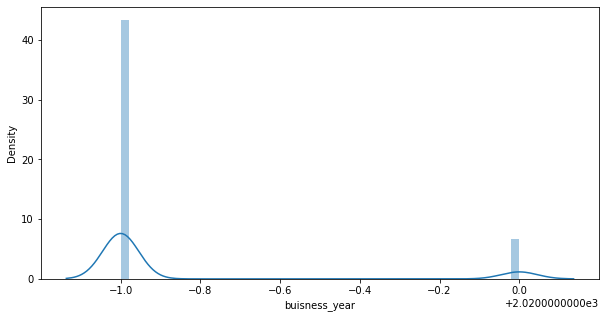
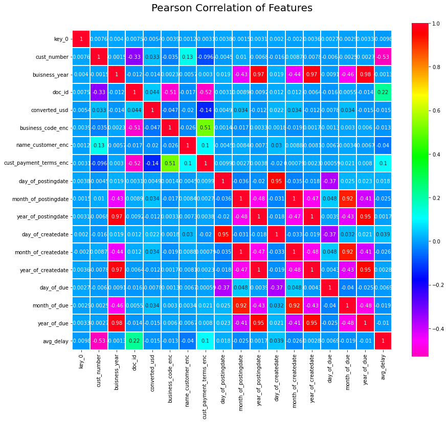

# Payment Date Prediction 


### Importing related Libraries 


```python
import pandas as pd
import numpy as np
import seaborn as sns
import matplotlib.pyplot as plt
import warnings
warnings.filterwarnings('ignore')
```

### Storing the dataset into the Dataframe


```python
df=pd.read_csv(r"C:\Users\amitp\hr\dataset.csv")
df
```


<div>
<style scoped>
    .dataframe tbody tr th:only-of-type {
        vertical-align: middle;
    }

    .dataframe tbody tr th {
        vertical-align: top;
    }

    .dataframe thead th {
        text-align: right;
    }
</style>
<table border="1" class="dataframe">
  <thead>
    <tr style="text-align: right;">
      <th></th>
      <th>business_code</th>
      <th>cust_number</th>
      <th>name_customer</th>
      <th>clear_date</th>
      <th>buisness_year</th>
      <th>doc_id</th>
      <th>posting_date</th>
      <th>document_create_date</th>
      <th>document_create_date.1</th>
      <th>due_in_date</th>
      <th>invoice_currency</th>
      <th>document type</th>
      <th>posting_id</th>
      <th>area_business</th>
      <th>total_open_amount</th>
      <th>baseline_create_date</th>
      <th>cust_payment_terms</th>
      <th>invoice_id</th>
      <th>isOpen</th>
    </tr>
  </thead>
  <tbody>
    <tr>
      <th>0</th>
      <td>U001</td>
      <td>0200769623</td>
      <td>WAL-MAR corp</td>
      <td>2020-02-11 00:00:00</td>
      <td>2020.0</td>
      <td>1.930438e+09</td>
      <td>2020-01-26</td>
      <td>20200125</td>
      <td>20200126</td>
      <td>20200210.0</td>
      <td>USD</td>
      <td>RV</td>
      <td>1.0</td>
      <td>NaN</td>
      <td>54273.28</td>
      <td>20200126.0</td>
      <td>NAH4</td>
      <td>1.930438e+09</td>
      <td>0</td>
    </tr>
    <tr>
      <th>1</th>
      <td>U001</td>
      <td>0200980828</td>
      <td>BEN E</td>
      <td>2019-08-08 00:00:00</td>
      <td>2019.0</td>
      <td>1.929646e+09</td>
      <td>2019-07-22</td>
      <td>20190722</td>
      <td>20190722</td>
      <td>20190811.0</td>
      <td>USD</td>
      <td>RV</td>
      <td>1.0</td>
      <td>NaN</td>
      <td>79656.60</td>
      <td>20190722.0</td>
      <td>NAD1</td>
      <td>1.929646e+09</td>
      <td>0</td>
    </tr>
    <tr>
      <th>2</th>
      <td>U001</td>
      <td>0200792734</td>
      <td>MDV/ trust</td>
      <td>2019-12-30 00:00:00</td>
      <td>2019.0</td>
      <td>1.929874e+09</td>
      <td>2019-09-14</td>
      <td>20190914</td>
      <td>20190914</td>
      <td>20190929.0</td>
      <td>USD</td>
      <td>RV</td>
      <td>1.0</td>
      <td>NaN</td>
      <td>2253.86</td>
      <td>20190914.0</td>
      <td>NAA8</td>
      <td>1.929874e+09</td>
      <td>0</td>
    </tr>
    <tr>
      <th>3</th>
      <td>CA02</td>
      <td>0140105686</td>
      <td>SYSC llc</td>
      <td>NaN</td>
      <td>2020.0</td>
      <td>2.960623e+09</td>
      <td>2020-03-30</td>
      <td>20200330</td>
      <td>20200330</td>
      <td>20200410.0</td>
      <td>CAD</td>
      <td>RV</td>
      <td>1.0</td>
      <td>NaN</td>
      <td>3299.70</td>
      <td>20200331.0</td>
      <td>CA10</td>
      <td>2.960623e+09</td>
      <td>1</td>
    </tr>
    <tr>
      <th>4</th>
      <td>U001</td>
      <td>0200769623</td>
      <td>WAL-MAR foundation</td>
      <td>2019-11-25 00:00:00</td>
      <td>2019.0</td>
      <td>1.930148e+09</td>
      <td>2019-11-13</td>
      <td>20191113</td>
      <td>20191113</td>
      <td>20191128.0</td>
      <td>USD</td>
      <td>RV</td>
      <td>1.0</td>
      <td>NaN</td>
      <td>33133.29</td>
      <td>20191113.0</td>
      <td>NAH4</td>
      <td>1.930148e+09</td>
      <td>0</td>
    </tr>
    <tr>
      <th>...</th>
      <td>...</td>
      <td>...</td>
      <td>...</td>
      <td>...</td>
      <td>...</td>
      <td>...</td>
      <td>...</td>
      <td>...</td>
      <td>...</td>
      <td>...</td>
      <td>...</td>
      <td>...</td>
      <td>...</td>
      <td>...</td>
      <td>...</td>
      <td>...</td>
      <td>...</td>
      <td>...</td>
      <td>...</td>
    </tr>
    <tr>
      <th>49995</th>
      <td>U001</td>
      <td>0200561861</td>
      <td>CO corporation</td>
      <td>NaN</td>
      <td>2020.0</td>
      <td>1.930797e+09</td>
      <td>2020-04-21</td>
      <td>20200417</td>
      <td>20200421</td>
      <td>20200506.0</td>
      <td>USD</td>
      <td>RV</td>
      <td>1.0</td>
      <td>NaN</td>
      <td>3187.86</td>
      <td>20200421.0</td>
      <td>NAA8</td>
      <td>1.930797e+09</td>
      <td>1</td>
    </tr>
    <tr>
      <th>49996</th>
      <td>U001</td>
      <td>0200769623</td>
      <td>WAL-MAR co</td>
      <td>2019-09-03 00:00:00</td>
      <td>2019.0</td>
      <td>1.929744e+09</td>
      <td>2019-08-15</td>
      <td>20190814</td>
      <td>20190815</td>
      <td>20190830.0</td>
      <td>USD</td>
      <td>RV</td>
      <td>1.0</td>
      <td>NaN</td>
      <td>6766.54</td>
      <td>20190815.0</td>
      <td>NAH4</td>
      <td>1.929744e+09</td>
      <td>0</td>
    </tr>
    <tr>
      <th>49997</th>
      <td>U001</td>
      <td>0200772595</td>
      <td>SAFEW associates</td>
      <td>2020-03-05 00:00:00</td>
      <td>2020.0</td>
      <td>1.930537e+09</td>
      <td>2020-02-19</td>
      <td>20200218</td>
      <td>20200219</td>
      <td>20200305.0</td>
      <td>USD</td>
      <td>RV</td>
      <td>1.0</td>
      <td>NaN</td>
      <td>6120.86</td>
      <td>20200219.0</td>
      <td>NAA8</td>
      <td>1.930537e+09</td>
      <td>0</td>
    </tr>
    <tr>
      <th>49998</th>
      <td>U001</td>
      <td>0200726979</td>
      <td>BJ'S  llc</td>
      <td>2019-12-12 00:00:00</td>
      <td>2019.0</td>
      <td>1.930199e+09</td>
      <td>2019-11-27</td>
      <td>20191126</td>
      <td>20191127</td>
      <td>20191212.0</td>
      <td>USD</td>
      <td>RV</td>
      <td>1.0</td>
      <td>NaN</td>
      <td>63.48</td>
      <td>20191127.0</td>
      <td>NAA8</td>
      <td>1.930199e+09</td>
      <td>0</td>
    </tr>
    <tr>
      <th>49999</th>
      <td>U001</td>
      <td>0200020431</td>
      <td>DEC corp</td>
      <td>2019-01-15 00:00:00</td>
      <td>2019.0</td>
      <td>1.928576e+09</td>
      <td>2019-01-05</td>
      <td>20190105</td>
      <td>20190105</td>
      <td>20190124.0</td>
      <td>USD</td>
      <td>RV</td>
      <td>1.0</td>
      <td>NaN</td>
      <td>1790.30</td>
      <td>20190101.0</td>
      <td>NAM4</td>
      <td>1.928576e+09</td>
      <td>0</td>
    </tr>
  </tbody>
</table>
<p>50000 rows × 19 columns</p>
</div>


### Checking the shape of the dataframe


```python
df.shape
```


    (50000, 19)


### Checking the Detail information of the dataframe


```python
df.info
```


    <bound method DataFrame.info of       business_code cust_number       name_customer           clear_date  \
    0              U001  0200769623        WAL-MAR corp  2020-02-11 00:00:00   
    1              U001  0200980828              BEN E   2019-08-08 00:00:00   
    2              U001  0200792734          MDV/ trust  2019-12-30 00:00:00   
    3              CA02  0140105686            SYSC llc                  NaN   
    4              U001  0200769623  WAL-MAR foundation  2019-11-25 00:00:00   
    ...             ...         ...                 ...                  ...   
    49995          U001  0200561861      CO corporation                  NaN   
    49996          U001  0200769623          WAL-MAR co  2019-09-03 00:00:00   
    49997          U001  0200772595    SAFEW associates  2020-03-05 00:00:00   
    49998          U001  0200726979           BJ'S  llc  2019-12-12 00:00:00   
    49999          U001  0200020431            DEC corp  2019-01-15 00:00:00   
    
           buisness_year        doc_id posting_date  document_create_date  \
    0             2020.0  1.930438e+09   2020-01-26              20200125   
    1             2019.0  1.929646e+09   2019-07-22              20190722   
    2             2019.0  1.929874e+09   2019-09-14              20190914   
    3             2020.0  2.960623e+09   2020-03-30              20200330   
    4             2019.0  1.930148e+09   2019-11-13              20191113   
    ...              ...           ...          ...                   ...   
    49995         2020.0  1.930797e+09   2020-04-21              20200417   
    49996         2019.0  1.929744e+09   2019-08-15              20190814   
    49997         2020.0  1.930537e+09   2020-02-19              20200218   
    49998         2019.0  1.930199e+09   2019-11-27              20191126   
    49999         2019.0  1.928576e+09   2019-01-05              20190105   
    
           document_create_date.1  due_in_date invoice_currency document type  \
    0                    20200126   20200210.0              USD            RV   
    1                    20190722   20190811.0              USD            RV   
    2                    20190914   20190929.0              USD            RV   
    3                    20200330   20200410.0              CAD            RV   
    4                    20191113   20191128.0              USD            RV   
    ...                       ...          ...              ...           ...   
    49995                20200421   20200506.0              USD            RV   
    49996                20190815   20190830.0              USD            RV   
    49997                20200219   20200305.0              USD            RV   
    49998                20191127   20191212.0              USD            RV   
    49999                20190105   20190124.0              USD            RV   
    
           posting_id  area_business  total_open_amount  baseline_create_date  \
    0             1.0            NaN           54273.28            20200126.0   
    1             1.0            NaN           79656.60            20190722.0   
    2             1.0            NaN            2253.86            20190914.0   
    3             1.0            NaN            3299.70            20200331.0   
    4             1.0            NaN           33133.29            20191113.0   
    ...           ...            ...                ...                   ...   
    49995         1.0            NaN            3187.86            20200421.0   
    49996         1.0            NaN            6766.54            20190815.0   
    49997         1.0            NaN            6120.86            20200219.0   
    49998         1.0            NaN              63.48            20191127.0   
    49999         1.0            NaN            1790.30            20190101.0   
    
          cust_payment_terms    invoice_id  isOpen  
    0                   NAH4  1.930438e+09       0  
    1                   NAD1  1.929646e+09       0  
    2                   NAA8  1.929874e+09       0  
    3                   CA10  2.960623e+09       1  
    4                   NAH4  1.930148e+09       0  
    ...                  ...           ...     ...  
    49995               NAA8  1.930797e+09       1  
    49996               NAH4  1.929744e+09       0  
    49997               NAA8  1.930537e+09       0  
    49998               NAA8  1.930199e+09       0  
    49999               NAM4  1.928576e+09       0  
    
    [50000 rows x 19 columns]>


### Displaying All the column names


```python
df.columns
```


    Index(['business_code', 'cust_number', 'name_customer', 'clear_date',
           'buisness_year', 'doc_id', 'posting_date', 'document_create_date',
           'document_create_date.1', 'due_in_date', 'invoice_currency',
           'document type', 'posting_id', 'area_business', 'total_open_amount',
           'baseline_create_date', 'cust_payment_terms', 'invoice_id', 'isOpen'],
          dtype='object')


### Describing the entire dataset


```python
df.describe()
```


<div>
<style scoped>
    .dataframe tbody tr th:only-of-type {
        vertical-align: middle;
    }

    .dataframe tbody tr th {
        vertical-align: top;
    }

    .dataframe thead th {
        text-align: right;
    }
</style>
<table border="1" class="dataframe">
  <thead>
    <tr style="text-align: right;">
      <th></th>
      <th>buisness_year</th>
      <th>doc_id</th>
      <th>document_create_date</th>
      <th>document_create_date.1</th>
      <th>due_in_date</th>
      <th>posting_id</th>
      <th>area_business</th>
      <th>total_open_amount</th>
      <th>baseline_create_date</th>
      <th>invoice_id</th>
      <th>isOpen</th>
    </tr>
  </thead>
  <tbody>
    <tr>
      <th>count</th>
      <td>50000.000000</td>
      <td>5.000000e+04</td>
      <td>5.000000e+04</td>
      <td>5.000000e+04</td>
      <td>5.000000e+04</td>
      <td>50000.0</td>
      <td>0.0</td>
      <td>50000.000000</td>
      <td>5.000000e+04</td>
      <td>4.999400e+04</td>
      <td>50000.000000</td>
    </tr>
    <tr>
      <th>mean</th>
      <td>2019.305700</td>
      <td>2.012238e+09</td>
      <td>2.019351e+07</td>
      <td>2.019354e+07</td>
      <td>2.019368e+07</td>
      <td>1.0</td>
      <td>NaN</td>
      <td>32337.021651</td>
      <td>2.019354e+07</td>
      <td>2.011340e+09</td>
      <td>0.200000</td>
    </tr>
    <tr>
      <th>std</th>
      <td>0.460708</td>
      <td>2.885235e+08</td>
      <td>4.496041e+03</td>
      <td>4.482134e+03</td>
      <td>4.470614e+03</td>
      <td>0.0</td>
      <td>NaN</td>
      <td>39205.975231</td>
      <td>4.482701e+03</td>
      <td>2.766335e+08</td>
      <td>0.400004</td>
    </tr>
    <tr>
      <th>min</th>
      <td>2019.000000</td>
      <td>1.928502e+09</td>
      <td>2.018123e+07</td>
      <td>2.018123e+07</td>
      <td>2.018122e+07</td>
      <td>1.0</td>
      <td>NaN</td>
      <td>0.720000</td>
      <td>2.018121e+07</td>
      <td>1.928502e+09</td>
      <td>0.000000</td>
    </tr>
    <tr>
      <th>25%</th>
      <td>2019.000000</td>
      <td>1.929342e+09</td>
      <td>2.019050e+07</td>
      <td>2.019051e+07</td>
      <td>2.019052e+07</td>
      <td>1.0</td>
      <td>NaN</td>
      <td>4928.312500</td>
      <td>2.019050e+07</td>
      <td>1.929342e+09</td>
      <td>0.000000</td>
    </tr>
    <tr>
      <th>50%</th>
      <td>2019.000000</td>
      <td>1.929964e+09</td>
      <td>2.019091e+07</td>
      <td>2.019091e+07</td>
      <td>2.019093e+07</td>
      <td>1.0</td>
      <td>NaN</td>
      <td>17609.010000</td>
      <td>2.019091e+07</td>
      <td>1.929964e+09</td>
      <td>0.000000</td>
    </tr>
    <tr>
      <th>75%</th>
      <td>2020.000000</td>
      <td>1.930619e+09</td>
      <td>2.020013e+07</td>
      <td>2.020013e+07</td>
      <td>2.020022e+07</td>
      <td>1.0</td>
      <td>NaN</td>
      <td>47133.635000</td>
      <td>2.020013e+07</td>
      <td>1.930619e+09</td>
      <td>0.000000</td>
    </tr>
    <tr>
      <th>max</th>
      <td>2020.000000</td>
      <td>9.500000e+09</td>
      <td>2.020052e+07</td>
      <td>2.020052e+07</td>
      <td>2.020071e+07</td>
      <td>1.0</td>
      <td>NaN</td>
      <td>668593.360000</td>
      <td>2.020052e+07</td>
      <td>2.960636e+09</td>
      <td>1.000000</td>
    </tr>
  </tbody>
</table>
</div>


# Data Cleaning

- Top 5 records from the dataset


```python
df.head()
```


<div>
<style scoped>
    .dataframe tbody tr th:only-of-type {
        vertical-align: middle;
    }

    .dataframe tbody tr th {
        vertical-align: top;
    }

    .dataframe thead th {
        text-align: right;
    }
</style>
<table border="1" class="dataframe">
  <thead>
    <tr style="text-align: right;">
      <th></th>
      <th>business_code</th>
      <th>cust_number</th>
      <th>name_customer</th>
      <th>clear_date</th>
      <th>buisness_year</th>
      <th>doc_id</th>
      <th>posting_date</th>
      <th>document_create_date</th>
      <th>document_create_date.1</th>
      <th>due_in_date</th>
      <th>invoice_currency</th>
      <th>document type</th>
      <th>posting_id</th>
      <th>area_business</th>
      <th>total_open_amount</th>
      <th>baseline_create_date</th>
      <th>cust_payment_terms</th>
      <th>invoice_id</th>
      <th>isOpen</th>
    </tr>
  </thead>
  <tbody>
    <tr>
      <th>0</th>
      <td>U001</td>
      <td>0200769623</td>
      <td>WAL-MAR corp</td>
      <td>2020-02-11 00:00:00</td>
      <td>2020.0</td>
      <td>1.930438e+09</td>
      <td>2020-01-26</td>
      <td>20200125</td>
      <td>20200126</td>
      <td>20200210.0</td>
      <td>USD</td>
      <td>RV</td>
      <td>1.0</td>
      <td>NaN</td>
      <td>54273.28</td>
      <td>20200126.0</td>
      <td>NAH4</td>
      <td>1.930438e+09</td>
      <td>0</td>
    </tr>
    <tr>
      <th>1</th>
      <td>U001</td>
      <td>0200980828</td>
      <td>BEN E</td>
      <td>2019-08-08 00:00:00</td>
      <td>2019.0</td>
      <td>1.929646e+09</td>
      <td>2019-07-22</td>
      <td>20190722</td>
      <td>20190722</td>
      <td>20190811.0</td>
      <td>USD</td>
      <td>RV</td>
      <td>1.0</td>
      <td>NaN</td>
      <td>79656.60</td>
      <td>20190722.0</td>
      <td>NAD1</td>
      <td>1.929646e+09</td>
      <td>0</td>
    </tr>
    <tr>
      <th>2</th>
      <td>U001</td>
      <td>0200792734</td>
      <td>MDV/ trust</td>
      <td>2019-12-30 00:00:00</td>
      <td>2019.0</td>
      <td>1.929874e+09</td>
      <td>2019-09-14</td>
      <td>20190914</td>
      <td>20190914</td>
      <td>20190929.0</td>
      <td>USD</td>
      <td>RV</td>
      <td>1.0</td>
      <td>NaN</td>
      <td>2253.86</td>
      <td>20190914.0</td>
      <td>NAA8</td>
      <td>1.929874e+09</td>
      <td>0</td>
    </tr>
    <tr>
      <th>3</th>
      <td>CA02</td>
      <td>0140105686</td>
      <td>SYSC llc</td>
      <td>NaN</td>
      <td>2020.0</td>
      <td>2.960623e+09</td>
      <td>2020-03-30</td>
      <td>20200330</td>
      <td>20200330</td>
      <td>20200410.0</td>
      <td>CAD</td>
      <td>RV</td>
      <td>1.0</td>
      <td>NaN</td>
      <td>3299.70</td>
      <td>20200331.0</td>
      <td>CA10</td>
      <td>2.960623e+09</td>
      <td>1</td>
    </tr>
    <tr>
      <th>4</th>
      <td>U001</td>
      <td>0200769623</td>
      <td>WAL-MAR foundation</td>
      <td>2019-11-25 00:00:00</td>
      <td>2019.0</td>
      <td>1.930148e+09</td>
      <td>2019-11-13</td>
      <td>20191113</td>
      <td>20191113</td>
      <td>20191128.0</td>
      <td>USD</td>
      <td>RV</td>
      <td>1.0</td>
      <td>NaN</td>
      <td>33133.29</td>
      <td>20191113.0</td>
      <td>NAH4</td>
      <td>1.930148e+09</td>
      <td>0</td>
    </tr>
  </tbody>
</table>
</div>


###  Null values percentage against every columns (compared to the total number of records)

- Output  : area_business - 100% null, clear_data = 20% null, invoice_id = 0.12% null


```python
nullpercent=df.isna().mean()*100
nullpercent
```


    business_code               0.000
    cust_number                 0.000
    name_customer               0.000
    clear_date                 20.000
    buisness_year               0.000
    doc_id                      0.000
    posting_date                0.000
    document_create_date        0.000
    document_create_date.1      0.000
    due_in_date                 0.000
    invoice_currency            0.000
    document type               0.000
    posting_id                  0.000
    area_business             100.000
    total_open_amount           0.000
    baseline_create_date        0.000
    cust_payment_terms          0.000
    invoice_id                  0.012
    isOpen                      0.000
    dtype: float64


### Invoice_id and Doc_Id display

Many would have same invoice_id and doc_id


```python
df[["invoice_id","doc_id"]]
```


<div>
<style scoped>
    .dataframe tbody tr th:only-of-type {
        vertical-align: middle;
    }

    .dataframe tbody tr th {
        vertical-align: top;
    }

    .dataframe thead th {
        text-align: right;
    }
</style>
<table border="1" class="dataframe">
  <thead>
    <tr style="text-align: right;">
      <th></th>
      <th>invoice_id</th>
      <th>doc_id</th>
    </tr>
  </thead>
  <tbody>
    <tr>
      <th>0</th>
      <td>1.930438e+09</td>
      <td>1.930438e+09</td>
    </tr>
    <tr>
      <th>1</th>
      <td>1.929646e+09</td>
      <td>1.929646e+09</td>
    </tr>
    <tr>
      <th>2</th>
      <td>1.929874e+09</td>
      <td>1.929874e+09</td>
    </tr>
    <tr>
      <th>3</th>
      <td>2.960623e+09</td>
      <td>2.960623e+09</td>
    </tr>
    <tr>
      <th>4</th>
      <td>1.930148e+09</td>
      <td>1.930148e+09</td>
    </tr>
    <tr>
      <th>...</th>
      <td>...</td>
      <td>...</td>
    </tr>
    <tr>
      <th>49995</th>
      <td>1.930797e+09</td>
      <td>1.930797e+09</td>
    </tr>
    <tr>
      <th>49996</th>
      <td>1.929744e+09</td>
      <td>1.929744e+09</td>
    </tr>
    <tr>
      <th>49997</th>
      <td>1.930537e+09</td>
      <td>1.930537e+09</td>
    </tr>
    <tr>
      <th>49998</th>
      <td>1.930199e+09</td>
      <td>1.930199e+09</td>
    </tr>
    <tr>
      <th>49999</th>
      <td>1.928576e+09</td>
      <td>1.928576e+09</td>
    </tr>
  </tbody>
</table>
<p>50000 rows × 2 columns</p>
</div>


#### Code to check - 'baseline_create_date',"document_create_date",'document_create_date.1' - these columns are almost same.

-If they are same, we need to drop them later


```python
df[['baseline_create_date',"document_create_date",'document_create_date.1']]
```


<div>
<style scoped>
    .dataframe tbody tr th:only-of-type {
        vertical-align: middle;
    }

    .dataframe tbody tr th {
        vertical-align: top;
    }

    .dataframe thead th {
        text-align: right;
    }
</style>
<table border="1" class="dataframe">
  <thead>
    <tr style="text-align: right;">
      <th></th>
      <th>baseline_create_date</th>
      <th>document_create_date</th>
      <th>document_create_date.1</th>
    </tr>
  </thead>
  <tbody>
    <tr>
      <th>0</th>
      <td>20200126.0</td>
      <td>20200125</td>
      <td>20200126</td>
    </tr>
    <tr>
      <th>1</th>
      <td>20190722.0</td>
      <td>20190722</td>
      <td>20190722</td>
    </tr>
    <tr>
      <th>2</th>
      <td>20190914.0</td>
      <td>20190914</td>
      <td>20190914</td>
    </tr>
    <tr>
      <th>3</th>
      <td>20200331.0</td>
      <td>20200330</td>
      <td>20200330</td>
    </tr>
    <tr>
      <th>4</th>
      <td>20191113.0</td>
      <td>20191113</td>
      <td>20191113</td>
    </tr>
    <tr>
      <th>...</th>
      <td>...</td>
      <td>...</td>
      <td>...</td>
    </tr>
    <tr>
      <th>49995</th>
      <td>20200421.0</td>
      <td>20200417</td>
      <td>20200421</td>
    </tr>
    <tr>
      <th>49996</th>
      <td>20190815.0</td>
      <td>20190814</td>
      <td>20190815</td>
    </tr>
    <tr>
      <th>49997</th>
      <td>20200219.0</td>
      <td>20200218</td>
      <td>20200219</td>
    </tr>
    <tr>
      <th>49998</th>
      <td>20191127.0</td>
      <td>20191126</td>
      <td>20191127</td>
    </tr>
    <tr>
      <th>49999</th>
      <td>20190101.0</td>
      <td>20190105</td>
      <td>20190105</td>
    </tr>
  </tbody>
</table>
<p>50000 rows × 3 columns</p>
</div>


#### Checking, Column 'posting_id' is constant columns or not


```python
df[["posting_id"]]
```


<div>
<style scoped>
    .dataframe tbody tr th:only-of-type {
        vertical-align: middle;
    }

    .dataframe tbody tr th {
        vertical-align: top;
    }

    .dataframe thead th {
        text-align: right;
    }
</style>
<table border="1" class="dataframe">
  <thead>
    <tr style="text-align: right;">
      <th></th>
      <th>posting_id</th>
    </tr>
  </thead>
  <tbody>
    <tr>
      <th>0</th>
      <td>1.0</td>
    </tr>
    <tr>
      <th>1</th>
      <td>1.0</td>
    </tr>
    <tr>
      <th>2</th>
      <td>1.0</td>
    </tr>
    <tr>
      <th>3</th>
      <td>1.0</td>
    </tr>
    <tr>
      <th>4</th>
      <td>1.0</td>
    </tr>
    <tr>
      <th>...</th>
      <td>...</td>
    </tr>
    <tr>
      <th>49995</th>
      <td>1.0</td>
    </tr>
    <tr>
      <th>49996</th>
      <td>1.0</td>
    </tr>
    <tr>
      <th>49997</th>
      <td>1.0</td>
    </tr>
    <tr>
      <th>49998</th>
      <td>1.0</td>
    </tr>
    <tr>
      <th>49999</th>
      <td>1.0</td>
    </tr>
  </tbody>
</table>
<p>50000 rows × 1 columns</p>
</div>


#### Checking 'isOpen' is a constant column and relevant column for this project or not


```python
df[['isOpen']]
```


<div>
<style scoped>
    .dataframe tbody tr th:only-of-type {
        vertical-align: middle;
    }

    .dataframe tbody tr th {
        vertical-align: top;
    }

    .dataframe thead th {
        text-align: right;
    }
</style>
<table border="1" class="dataframe">
  <thead>
    <tr style="text-align: right;">
      <th></th>
      <th>isOpen</th>
    </tr>
  </thead>
  <tbody>
    <tr>
      <th>0</th>
      <td>0</td>
    </tr>
    <tr>
      <th>1</th>
      <td>0</td>
    </tr>
    <tr>
      <th>2</th>
      <td>0</td>
    </tr>
    <tr>
      <th>3</th>
      <td>1</td>
    </tr>
    <tr>
      <th>4</th>
      <td>0</td>
    </tr>
    <tr>
      <th>...</th>
      <td>...</td>
    </tr>
    <tr>
      <th>49995</th>
      <td>1</td>
    </tr>
    <tr>
      <th>49996</th>
      <td>0</td>
    </tr>
    <tr>
      <th>49997</th>
      <td>0</td>
    </tr>
    <tr>
      <th>49998</th>
      <td>0</td>
    </tr>
    <tr>
      <th>49999</th>
      <td>0</td>
    </tr>
  </tbody>
</table>
<p>50000 rows × 1 columns</p>
</div>


### Code to drop all the following columns from the dataframe

- 'area_business'
- "posting_id"
- "invoice_id"
- "document_create_date"
- "isOpen"
- 'document type' 
- 'document_create_date.1


```python
df.drop(['area_business',
"posting_id",
"invoice_id",
"document_create_date",
"isOpen",
'document type',
'document_create_date.1'],axis=1,inplace=True)
```

### Checking the dataframe whether all the columns are removed or not 


```python
df.columns
```


    Index(['business_code', 'cust_number', 'name_customer', 'clear_date',
           'buisness_year', 'doc_id', 'posting_date', 'due_in_date',
           'invoice_currency', 'total_open_amount', 'baseline_create_date',
           'cust_payment_terms'],
          dtype='object')


### Showing all the Duplicate rows from the dataframe


```python
df.duplicated(keep='first')
```


    0        False
    1        False
    2        False
    3        False
    4        False
             ...  
    49995    False
    49996    False
    49997    False
    49998    False
    49999    False
    Length: 50000, dtype: bool


### Number of Duplicate Rows


```python
df.duplicated().sum()
```


    1161


### Dropping all the Duplicate Rows


```python
df.drop_duplicates(inplace=True)
```

####  Check for all duplicate rows 

-  It must be 0 by now


```python
df.duplicated().sum()
```


    0


### The number of Rows and Columns in your dataset


```python
df.shape
```


    (48839, 12)


### Total count of null values in each columns


```python
df.isnull().sum()
```


    business_code              0
    cust_number                0
    name_customer              0
    clear_date              9681
    buisness_year              0
    doc_id                     0
    posting_date               0
    due_in_date                0
    invoice_currency           0
    total_open_amount          0
    baseline_create_date       0
    cust_payment_terms         0
    dtype: int64


#Data type Conversion 

### The data type of each column of the dataframe


```python
df.dtypes
```


    business_code            object
    cust_number              object
    name_customer            object
    clear_date               object
    buisness_year           float64
    doc_id                  float64
    posting_date             object
    due_in_date             float64
    invoice_currency         object
    total_open_amount       float64
    baseline_create_date    float64
    cust_payment_terms       object
    dtype: object


### Checking the datatype format of below columns

- clear_date  
- posting_date
- due_in_date 
- baseline_create_date


```python
df.dtypes[['clear_date',
'posting_date',
'due_in_date',
'baseline_create_date']]
```


    clear_date               object
    posting_date             object
    due_in_date             float64
    baseline_create_date    float64
    dtype: object


### Converting date columns into date time formats

- clear_date  
- posting_date
- due_in_date 
- baseline_create_date
- **Note - You have to convert all these above columns into "%Y%m%d" format**


```python
df["clear_date"]=pd.to_datetime(df["clear_date"])
df["posting_date"]=pd.to_datetime(df["posting_date"])
df ["due_in_date"]=pd.to_datetime(df["due_in_date"], format="%Y%m%d")
df["baseline_create_date"]=pd.to_datetime(df["baseline_create_date"], format="%Y%m%d")
```

### Checking the datatype of all the columns after conversion of the above 4 columns


```python
df.dtypes[['clear_date','posting_date','due_in_date','baseline_create_date']]
```


    clear_date              datetime64[ns]
    posting_date            datetime64[ns]
    due_in_date             datetime64[ns]
    baseline_create_date    datetime64[ns]
    dtype: object


#### the invoice_currency column contains two different categories, USD and CAD

- Count of each currency 


```python
df["invoice_currency"].value_counts()
```


    USD    45011
    CAD     3828
    Name: invoice_currency, dtype: int64


#### display the "total_open_amount" column value


```python
df[["total_open_amount"]]
```


<div>
<style scoped>
    .dataframe tbody tr th:only-of-type {
        vertical-align: middle;
    }

    .dataframe tbody tr th {
        vertical-align: top;
    }

    .dataframe thead th {
        text-align: right;
    }
</style>
<table border="1" class="dataframe">
  <thead>
    <tr style="text-align: right;">
      <th></th>
      <th>total_open_amount</th>
    </tr>
  </thead>
  <tbody>
    <tr>
      <th>0</th>
      <td>54273.28</td>
    </tr>
    <tr>
      <th>1</th>
      <td>79656.60</td>
    </tr>
    <tr>
      <th>2</th>
      <td>2253.86</td>
    </tr>
    <tr>
      <th>3</th>
      <td>3299.70</td>
    </tr>
    <tr>
      <th>4</th>
      <td>33133.29</td>
    </tr>
    <tr>
      <th>...</th>
      <td>...</td>
    </tr>
    <tr>
      <th>49995</th>
      <td>3187.86</td>
    </tr>
    <tr>
      <th>49996</th>
      <td>6766.54</td>
    </tr>
    <tr>
      <th>49997</th>
      <td>6120.86</td>
    </tr>
    <tr>
      <th>49998</th>
      <td>63.48</td>
    </tr>
    <tr>
      <th>49999</th>
      <td>1790.30</td>
    </tr>
  </tbody>
</table>
<p>48839 rows × 1 columns</p>
</div>


### Convert all CAD into USD currency of "total_open_amount" column

- 1 CAD = 0.7 USD
- Create a new column i.e "converted_usd" and store USD and convered CAD to USD


```python
df['total_open_amount']=np.where(df ['invoice_currency']=='USD',df ['total_open_amount']*1,df['total_open_amount']*0.7)
df['converted_usd']=df['total_open_amount']                                 
```

### Display the new "converted_usd" column values


```python
display_ipoll=pd.DataFrame({'converted_usd':df.converted_usd})
display_ipoll
```


<div>
<style scoped>
    .dataframe tbody tr th:only-of-type {
        vertical-align: middle;
    }

    .dataframe tbody tr th {
        vertical-align: top;
    }

    .dataframe thead th {
        text-align: right;
    }
</style>
<table border="1" class="dataframe">
  <thead>
    <tr style="text-align: right;">
      <th></th>
      <th>converted_usd</th>
    </tr>
  </thead>
  <tbody>
    <tr>
      <th>0</th>
      <td>54273.28</td>
    </tr>
    <tr>
      <th>1</th>
      <td>79656.60</td>
    </tr>
    <tr>
      <th>2</th>
      <td>2253.86</td>
    </tr>
    <tr>
      <th>3</th>
      <td>2309.79</td>
    </tr>
    <tr>
      <th>4</th>
      <td>33133.29</td>
    </tr>
    <tr>
      <th>...</th>
      <td>...</td>
    </tr>
    <tr>
      <th>49995</th>
      <td>3187.86</td>
    </tr>
    <tr>
      <th>49996</th>
      <td>6766.54</td>
    </tr>
    <tr>
      <th>49997</th>
      <td>6120.86</td>
    </tr>
    <tr>
      <th>49998</th>
      <td>63.48</td>
    </tr>
    <tr>
      <th>49999</th>
      <td>1790.30</td>
    </tr>
  </tbody>
</table>
<p>48839 rows × 1 columns</p>
</div>


### Display year wise total number of record 

- Note -  use "buisness_year" column for this 


```python
df[["buisness_year"]].value_counts()
```


    buisness_year
    2019.0           33975
    2020.0           14864
    dtype: int64


### Write the code to delete the following columns 

- 'invoice_currency'
- 'total_open_amount', 


```python
df.drop(['invoice_currency','total_open_amount'],axis=1,inplace=True)
```

### Write a code to check the number of columns in dataframe


```python
df.shape[1]
```


    11


# Splitting the Dataset 

### Look for all columns containing null value

- Note - Output expected is only one column 


```python
df.columns[df.isna().any()]
```


    Index(['clear_date'], dtype='object')


#### Find out the number of null values from the column that you got from the above code


```python
df['clear_date'].isna().sum()
```


    9681


### On basis of the above column we are spliting data into dataset

- First dataframe (refer that as maindata) only containing the rows, that have NO NULL data in that column ( This is going to be our train dataset ) 
- Second dataframe (refer that as nulldata) that contains the columns, that have Null data in that column ( This is going to be our test dataset ) 


```python
maindata=df[df['clear_date'].notna()]
nulldata=df[df['clear_date'].isna()]
```

### Check the number of Rows and Columns for both the dataframes 


```python
maindata.shape
```


    (39158, 11)


```python
nulldata.shape
```


    (9681, 11)


### Display the 5 records from maindata and nulldata dataframes


```python
maindata.head()
```


<div>
<style scoped>
    .dataframe tbody tr th:only-of-type {
        vertical-align: middle;
    }

    .dataframe tbody tr th {
        vertical-align: top;
    }

    .dataframe thead th {
        text-align: right;
    }
</style>
<table border="1" class="dataframe">
  <thead>
    <tr style="text-align: right;">
      <th></th>
      <th>business_code</th>
      <th>cust_number</th>
      <th>name_customer</th>
      <th>clear_date</th>
      <th>buisness_year</th>
      <th>doc_id</th>
      <th>posting_date</th>
      <th>due_in_date</th>
      <th>baseline_create_date</th>
      <th>cust_payment_terms</th>
      <th>converted_usd</th>
    </tr>
  </thead>
  <tbody>
    <tr>
      <th>0</th>
      <td>U001</td>
      <td>0200769623</td>
      <td>WAL-MAR corp</td>
      <td>2020-02-11</td>
      <td>2020.0</td>
      <td>1.930438e+09</td>
      <td>2020-01-26</td>
      <td>2020-02-10</td>
      <td>2020-01-26</td>
      <td>NAH4</td>
      <td>54273.280</td>
    </tr>
    <tr>
      <th>1</th>
      <td>U001</td>
      <td>0200980828</td>
      <td>BEN E</td>
      <td>2019-08-08</td>
      <td>2019.0</td>
      <td>1.929646e+09</td>
      <td>2019-07-22</td>
      <td>2019-08-11</td>
      <td>2019-07-22</td>
      <td>NAD1</td>
      <td>79656.600</td>
    </tr>
    <tr>
      <th>2</th>
      <td>U001</td>
      <td>0200792734</td>
      <td>MDV/ trust</td>
      <td>2019-12-30</td>
      <td>2019.0</td>
      <td>1.929874e+09</td>
      <td>2019-09-14</td>
      <td>2019-09-29</td>
      <td>2019-09-14</td>
      <td>NAA8</td>
      <td>2253.860</td>
    </tr>
    <tr>
      <th>4</th>
      <td>U001</td>
      <td>0200769623</td>
      <td>WAL-MAR foundation</td>
      <td>2019-11-25</td>
      <td>2019.0</td>
      <td>1.930148e+09</td>
      <td>2019-11-13</td>
      <td>2019-11-28</td>
      <td>2019-11-13</td>
      <td>NAH4</td>
      <td>33133.290</td>
    </tr>
    <tr>
      <th>5</th>
      <td>CA02</td>
      <td>0140106181</td>
      <td>THE  corporation</td>
      <td>2019-12-04</td>
      <td>2019.0</td>
      <td>2.960581e+09</td>
      <td>2019-09-20</td>
      <td>2019-10-04</td>
      <td>2019-09-24</td>
      <td>CA10</td>
      <td>15558.088</td>
    </tr>
  </tbody>
</table>
</div>


```python
nulldata.tail()
```


<div>
<style scoped>
    .dataframe tbody tr th:only-of-type {
        vertical-align: middle;
    }

    .dataframe tbody tr th {
        vertical-align: top;
    }

    .dataframe thead th {
        text-align: right;
    }
</style>
<table border="1" class="dataframe">
  <thead>
    <tr style="text-align: right;">
      <th></th>
      <th>business_code</th>
      <th>cust_number</th>
      <th>name_customer</th>
      <th>clear_date</th>
      <th>buisness_year</th>
      <th>doc_id</th>
      <th>posting_date</th>
      <th>due_in_date</th>
      <th>baseline_create_date</th>
      <th>cust_payment_terms</th>
      <th>converted_usd</th>
    </tr>
  </thead>
  <tbody>
    <tr>
      <th>49975</th>
      <td>U001</td>
      <td>0200769623</td>
      <td>WAL-MAR in</td>
      <td>NaT</td>
      <td>2020.0</td>
      <td>1.930625e+09</td>
      <td>2020-03-10</td>
      <td>2020-03-25</td>
      <td>2020-03-10</td>
      <td>NAH4</td>
      <td>13114.99</td>
    </tr>
    <tr>
      <th>49980</th>
      <td>U001</td>
      <td>0200769623</td>
      <td>WAL-MAR corporation</td>
      <td>NaT</td>
      <td>2020.0</td>
      <td>1.930851e+09</td>
      <td>2020-05-03</td>
      <td>2020-05-18</td>
      <td>2020-05-03</td>
      <td>NAH4</td>
      <td>8899.71</td>
    </tr>
    <tr>
      <th>49982</th>
      <td>U001</td>
      <td>0200148860</td>
      <td>DOLLA co</td>
      <td>NaT</td>
      <td>2020.0</td>
      <td>1.930638e+09</td>
      <td>2020-03-11</td>
      <td>2020-03-26</td>
      <td>2020-03-11</td>
      <td>NAA8</td>
      <td>4967.06</td>
    </tr>
    <tr>
      <th>49992</th>
      <td>U001</td>
      <td>0200900909</td>
      <td>SYSCO co</td>
      <td>NaT</td>
      <td>2020.0</td>
      <td>1.930702e+09</td>
      <td>2020-03-25</td>
      <td>2020-04-09</td>
      <td>2020-03-25</td>
      <td>NAA8</td>
      <td>1998.64</td>
    </tr>
    <tr>
      <th>49995</th>
      <td>U001</td>
      <td>0200561861</td>
      <td>CO corporation</td>
      <td>NaT</td>
      <td>2020.0</td>
      <td>1.930797e+09</td>
      <td>2020-04-21</td>
      <td>2020-05-06</td>
      <td>2020-04-21</td>
      <td>NAA8</td>
      <td>3187.86</td>
    </tr>
  </tbody>
</table>
</div>


## Considering the **maindata**

#### Generate a new column "Delay" from the existing columns

- Note - You are expected to create a new column 'Delay' from two existing columns, "clear_date" and "due_in_date" 
- Formula - Delay = clear_date - due_in_date


```python
maindata['delay']=maindata['clear_date'] - maindata['due_in_date']
maindata.head()
```


<div>
<style scoped>
    .dataframe tbody tr th:only-of-type {
        vertical-align: middle;
    }

    .dataframe tbody tr th {
        vertical-align: top;
    }

    .dataframe thead th {
        text-align: right;
    }
</style>
<table border="1" class="dataframe">
  <thead>
    <tr style="text-align: right;">
      <th></th>
      <th>business_code</th>
      <th>cust_number</th>
      <th>name_customer</th>
      <th>clear_date</th>
      <th>buisness_year</th>
      <th>doc_id</th>
      <th>posting_date</th>
      <th>due_in_date</th>
      <th>baseline_create_date</th>
      <th>cust_payment_terms</th>
      <th>converted_usd</th>
      <th>delay</th>
    </tr>
  </thead>
  <tbody>
    <tr>
      <th>0</th>
      <td>U001</td>
      <td>0200769623</td>
      <td>WAL-MAR corp</td>
      <td>2020-02-11</td>
      <td>2020.0</td>
      <td>1.930438e+09</td>
      <td>2020-01-26</td>
      <td>2020-02-10</td>
      <td>2020-01-26</td>
      <td>NAH4</td>
      <td>54273.280</td>
      <td>1 days</td>
    </tr>
    <tr>
      <th>1</th>
      <td>U001</td>
      <td>0200980828</td>
      <td>BEN E</td>
      <td>2019-08-08</td>
      <td>2019.0</td>
      <td>1.929646e+09</td>
      <td>2019-07-22</td>
      <td>2019-08-11</td>
      <td>2019-07-22</td>
      <td>NAD1</td>
      <td>79656.600</td>
      <td>-3 days</td>
    </tr>
    <tr>
      <th>2</th>
      <td>U001</td>
      <td>0200792734</td>
      <td>MDV/ trust</td>
      <td>2019-12-30</td>
      <td>2019.0</td>
      <td>1.929874e+09</td>
      <td>2019-09-14</td>
      <td>2019-09-29</td>
      <td>2019-09-14</td>
      <td>NAA8</td>
      <td>2253.860</td>
      <td>92 days</td>
    </tr>
    <tr>
      <th>4</th>
      <td>U001</td>
      <td>0200769623</td>
      <td>WAL-MAR foundation</td>
      <td>2019-11-25</td>
      <td>2019.0</td>
      <td>1.930148e+09</td>
      <td>2019-11-13</td>
      <td>2019-11-28</td>
      <td>2019-11-13</td>
      <td>NAH4</td>
      <td>33133.290</td>
      <td>-3 days</td>
    </tr>
    <tr>
      <th>5</th>
      <td>CA02</td>
      <td>0140106181</td>
      <td>THE  corporation</td>
      <td>2019-12-04</td>
      <td>2019.0</td>
      <td>2.960581e+09</td>
      <td>2019-09-20</td>
      <td>2019-10-04</td>
      <td>2019-09-24</td>
      <td>CA10</td>
      <td>15558.088</td>
      <td>61 days</td>
    </tr>
  </tbody>
</table>
</div>


### Generate a new column "avgdelay" from the existing columns

- Note - You are expected to make a new column "avgdelay" by grouping "name_customer" column with reapect to mean of the "Delay" column.
- This new column "avg_delay" is meant to store "customer_name" wise delay
- groupby('name_customer')['Delay'].mean(numeric_only=False)
- Display the new "avg_delay" column


```python
avg_delay=maindata.groupby('name_customer')['delay'].mean(numeric_only=False)
pd.DataFrame(avg_delay)
```


<div>
<style scoped>
    .dataframe tbody tr th:only-of-type {
        vertical-align: middle;
    }

    .dataframe tbody tr th {
        vertical-align: top;
    }

    .dataframe thead th {
        text-align: right;
    }
</style>
<table border="1" class="dataframe">
  <thead>
    <tr style="text-align: right;">
      <th></th>
      <th>delay</th>
    </tr>
    <tr>
      <th>name_customer</th>
      <th></th>
    </tr>
  </thead>
  <tbody>
    <tr>
      <th>11078 us</th>
      <td>17 days 00:00:00</td>
    </tr>
    <tr>
      <th>17135 associates</th>
      <td>-10 days +00:00:00</td>
    </tr>
    <tr>
      <th>17135 llc</th>
      <td>-3 days +00:00:00</td>
    </tr>
    <tr>
      <th>236008 associates</th>
      <td>-3 days +00:00:00</td>
    </tr>
    <tr>
      <th>99 CE</th>
      <td>2 days 00:00:00</td>
    </tr>
    <tr>
      <th>...</th>
      <td>...</td>
    </tr>
    <tr>
      <th>YEN BROS corp</th>
      <td>0 days 00:00:00</td>
    </tr>
    <tr>
      <th>YEN BROS corporation</th>
      <td>-1 days +12:00:00</td>
    </tr>
    <tr>
      <th>YEN BROS llc</th>
      <td>-2 days +00:00:00</td>
    </tr>
    <tr>
      <th>ZARCO co</th>
      <td>-1 days +00:00:00</td>
    </tr>
    <tr>
      <th>ZIYAD  us</th>
      <td>6 days 00:00:00</td>
    </tr>
  </tbody>
</table>
<p>3889 rows × 1 columns</p>
</div>


You need to add the "avg_delay" column with the maindata, mapped with "name_customer" column

 - Note - You need to use map function to map the avgdelay with respect to "name_customer" column


```python
maindata['avg_delay']=maindata['name_customer'].map(avg_delay)
maindata
```


<div>
<style scoped>
    .dataframe tbody tr th:only-of-type {
        vertical-align: middle;
    }

    .dataframe tbody tr th {
        vertical-align: top;
    }

    .dataframe thead th {
        text-align: right;
    }
</style>
<table border="1" class="dataframe">
  <thead>
    <tr style="text-align: right;">
      <th></th>
      <th>business_code</th>
      <th>cust_number</th>
      <th>name_customer</th>
      <th>clear_date</th>
      <th>buisness_year</th>
      <th>doc_id</th>
      <th>posting_date</th>
      <th>due_in_date</th>
      <th>baseline_create_date</th>
      <th>cust_payment_terms</th>
      <th>converted_usd</th>
      <th>delay</th>
      <th>avg_delay</th>
    </tr>
  </thead>
  <tbody>
    <tr>
      <th>0</th>
      <td>U001</td>
      <td>0200769623</td>
      <td>WAL-MAR corp</td>
      <td>2020-02-11</td>
      <td>2020.0</td>
      <td>1.930438e+09</td>
      <td>2020-01-26</td>
      <td>2020-02-10</td>
      <td>2020-01-26</td>
      <td>NAH4</td>
      <td>54273.280</td>
      <td>1 days</td>
      <td>-3 days +07:08:49.779837776</td>
    </tr>
    <tr>
      <th>1</th>
      <td>U001</td>
      <td>0200980828</td>
      <td>BEN E</td>
      <td>2019-08-08</td>
      <td>2019.0</td>
      <td>1.929646e+09</td>
      <td>2019-07-22</td>
      <td>2019-08-11</td>
      <td>2019-07-22</td>
      <td>NAD1</td>
      <td>79656.600</td>
      <td>-3 days</td>
      <td>19 days 00:00:00</td>
    </tr>
    <tr>
      <th>2</th>
      <td>U001</td>
      <td>0200792734</td>
      <td>MDV/ trust</td>
      <td>2019-12-30</td>
      <td>2019.0</td>
      <td>1.929874e+09</td>
      <td>2019-09-14</td>
      <td>2019-09-29</td>
      <td>2019-09-14</td>
      <td>NAA8</td>
      <td>2253.860</td>
      <td>92 days</td>
      <td>8 days 02:10:54.545454545</td>
    </tr>
    <tr>
      <th>4</th>
      <td>U001</td>
      <td>0200769623</td>
      <td>WAL-MAR foundation</td>
      <td>2019-11-25</td>
      <td>2019.0</td>
      <td>1.930148e+09</td>
      <td>2019-11-13</td>
      <td>2019-11-28</td>
      <td>2019-11-13</td>
      <td>NAH4</td>
      <td>33133.290</td>
      <td>-3 days</td>
      <td>-3 days +19:33:27.692307693</td>
    </tr>
    <tr>
      <th>5</th>
      <td>CA02</td>
      <td>0140106181</td>
      <td>THE  corporation</td>
      <td>2019-12-04</td>
      <td>2019.0</td>
      <td>2.960581e+09</td>
      <td>2019-09-20</td>
      <td>2019-10-04</td>
      <td>2019-09-24</td>
      <td>CA10</td>
      <td>15558.088</td>
      <td>61 days</td>
      <td>71 days 10:40:00</td>
    </tr>
    <tr>
      <th>...</th>
      <td>...</td>
      <td>...</td>
      <td>...</td>
      <td>...</td>
      <td>...</td>
      <td>...</td>
      <td>...</td>
      <td>...</td>
      <td>...</td>
      <td>...</td>
      <td>...</td>
      <td>...</td>
      <td>...</td>
    </tr>
    <tr>
      <th>49994</th>
      <td>U001</td>
      <td>0200762301</td>
      <td>C&amp;S WH trust</td>
      <td>2019-07-25</td>
      <td>2019.0</td>
      <td>1.929601e+09</td>
      <td>2019-07-10</td>
      <td>2019-07-25</td>
      <td>2019-07-10</td>
      <td>NAC6</td>
      <td>84780.400</td>
      <td>0 days</td>
      <td>-1 days +14:45:00</td>
    </tr>
    <tr>
      <th>49996</th>
      <td>U001</td>
      <td>0200769623</td>
      <td>WAL-MAR co</td>
      <td>2019-09-03</td>
      <td>2019.0</td>
      <td>1.929744e+09</td>
      <td>2019-08-15</td>
      <td>2019-08-30</td>
      <td>2019-08-15</td>
      <td>NAH4</td>
      <td>6766.540</td>
      <td>4 days</td>
      <td>-3 days +12:40:08.540925267</td>
    </tr>
    <tr>
      <th>49997</th>
      <td>U001</td>
      <td>0200772595</td>
      <td>SAFEW associates</td>
      <td>2020-03-05</td>
      <td>2020.0</td>
      <td>1.930537e+09</td>
      <td>2020-02-19</td>
      <td>2020-03-05</td>
      <td>2020-02-19</td>
      <td>NAA8</td>
      <td>6120.860</td>
      <td>0 days</td>
      <td>1 days 01:08:34.285714285</td>
    </tr>
    <tr>
      <th>49998</th>
      <td>U001</td>
      <td>0200726979</td>
      <td>BJ'S  llc</td>
      <td>2019-12-12</td>
      <td>2019.0</td>
      <td>1.930199e+09</td>
      <td>2019-11-27</td>
      <td>2019-12-12</td>
      <td>2019-11-27</td>
      <td>NAA8</td>
      <td>63.480</td>
      <td>0 days</td>
      <td>1 days 13:36:42.985074626</td>
    </tr>
    <tr>
      <th>49999</th>
      <td>U001</td>
      <td>0200020431</td>
      <td>DEC corp</td>
      <td>2019-01-15</td>
      <td>2019.0</td>
      <td>1.928576e+09</td>
      <td>2019-01-05</td>
      <td>2019-01-24</td>
      <td>2019-01-01</td>
      <td>NAM4</td>
      <td>1790.300</td>
      <td>-9 days</td>
      <td>-4 days +02:20:52.173913044</td>
    </tr>
  </tbody>
</table>
<p>39158 rows × 13 columns</p>
</div>


### Observe that the "avg_delay" column is in days format. You need to change the format into seconds

- Days_format :  17 days 00:00:00
- Format in seconds : 1641600.0


```python
maindata['avg_delay']=maindata['avg_delay'].dt.total_seconds()
```

### Display the maindata dataframe 


```python
maindata['avg_delay']
```


    0       -2.334702e+05
    1        1.641600e+06
    2        6.990545e+05
    4       -1.887923e+05
    5        6.172800e+06
                 ...     
    49994   -3.330000e+04
    49996   -2.135915e+05
    49997    9.051429e+04
    49998    1.354030e+05
    49999   -3.371478e+05
    Name: avg_delay, Length: 39158, dtype: float64


### Since you have created the "avg_delay" column from "Delay" and "clear_date" column, there is no need of these two columns anymore 

- You are expected to drop "Delay" and "clear_date" columns from maindata dataframe 


```python
maindata.drop(['delay','clear_date'],axis=1,inplace=True)
```

# Splitting of Train and the Test Data

### You need to split the "maindata" columns into X and y dataframe

- Note - y should have the target column i.e. "avg_delay" and the other column should be in X

- X is going to hold the source fields and y will be going to hold the target fields


```python
X=maindata.iloc[:,0:-1]
X.head()
```


<div>
<style scoped>
    .dataframe tbody tr th:only-of-type {
        vertical-align: middle;
    }

    .dataframe tbody tr th {
        vertical-align: top;
    }

    .dataframe thead th {
        text-align: right;
    }
</style>
<table border="1" class="dataframe">
  <thead>
    <tr style="text-align: right;">
      <th></th>
      <th>business_code</th>
      <th>cust_number</th>
      <th>name_customer</th>
      <th>buisness_year</th>
      <th>doc_id</th>
      <th>posting_date</th>
      <th>due_in_date</th>
      <th>baseline_create_date</th>
      <th>cust_payment_terms</th>
      <th>converted_usd</th>
    </tr>
  </thead>
  <tbody>
    <tr>
      <th>0</th>
      <td>U001</td>
      <td>0200769623</td>
      <td>WAL-MAR corp</td>
      <td>2020.0</td>
      <td>1.930438e+09</td>
      <td>2020-01-26</td>
      <td>2020-02-10</td>
      <td>2020-01-26</td>
      <td>NAH4</td>
      <td>54273.280</td>
    </tr>
    <tr>
      <th>1</th>
      <td>U001</td>
      <td>0200980828</td>
      <td>BEN E</td>
      <td>2019.0</td>
      <td>1.929646e+09</td>
      <td>2019-07-22</td>
      <td>2019-08-11</td>
      <td>2019-07-22</td>
      <td>NAD1</td>
      <td>79656.600</td>
    </tr>
    <tr>
      <th>2</th>
      <td>U001</td>
      <td>0200792734</td>
      <td>MDV/ trust</td>
      <td>2019.0</td>
      <td>1.929874e+09</td>
      <td>2019-09-14</td>
      <td>2019-09-29</td>
      <td>2019-09-14</td>
      <td>NAA8</td>
      <td>2253.860</td>
    </tr>
    <tr>
      <th>4</th>
      <td>U001</td>
      <td>0200769623</td>
      <td>WAL-MAR foundation</td>
      <td>2019.0</td>
      <td>1.930148e+09</td>
      <td>2019-11-13</td>
      <td>2019-11-28</td>
      <td>2019-11-13</td>
      <td>NAH4</td>
      <td>33133.290</td>
    </tr>
    <tr>
      <th>5</th>
      <td>CA02</td>
      <td>0140106181</td>
      <td>THE  corporation</td>
      <td>2019.0</td>
      <td>2.960581e+09</td>
      <td>2019-09-20</td>
      <td>2019-10-04</td>
      <td>2019-09-24</td>
      <td>CA10</td>
      <td>15558.088</td>
    </tr>
  </tbody>
</table>
</div>


```python
Y=maindata.iloc[:,-1]
Y.head()
```


    0   -2.334702e+05
    1    1.641600e+06
    2    6.990545e+05
    4   -1.887923e+05
    5    6.172800e+06
    Name: avg_delay, dtype: float64


#### You are expected to split both the dataframes into train and test format in 60:40 ratio 

- Note - The expected output should be in "X_train", "X_loc_test", "y_train", "y_loc_test" format 


```python
from sklearn.model_selection import train_test_split
X_train,X_loc_test,y_train,y_loc_test=train_test_split(X,Y,test_size=0.4)
```

### Please check for the number of rows and columns of all the new dataframes (all 4)


```python
X_train.shape,X_loc_test.shape,y_train.shape,y_loc_test.shape
```


    ((23494, 10), (15664, 10), (23494,), (15664,))


### Now you are expected to split the "X_loc_test" and "y_loc_test" dataset into "Test" and "Validation" (as the names given below) dataframe with 50:50 format 

- Note - The expected output should be in "X_val", "X_test", "y_val", "y_test" format


```python
X_val,X_test,y_val,y_test=train_test_split(X_loc_test,y_loc_test,test_size=0.5)
```

### Please check for the number of rows and columns of all the 4 dataframes 


```python
X_val.shape,X_test.shape,y_val.shape,y_test.shape
```


    ((7832, 10), (7832, 10), (7832,), (7832,))


# Exploratory Data Analysis (EDA) 

### Distribution Plot of the target variable (use the dataframe which contains the target field)

- Note - You are expected to make a distribution plot for the target variable 


```python
plt.figure(figsize=(20,10))
sns.distplot(Y)
```


    <AxesSubplot:xlabel='avg_delay', ylabel='Density'>


    

    


### You are expected to group the X_train dataset on 'name_customer' column with 'doc_id' in the x_train set

### Need to store the outcome into a new dataframe 

- Note code given for groupby statement- X_train.groupby(by=['name_customer'], as_index=False)['doc_id'].count()


```python
X_train.groupby(by=['name_customer'], as_index=False)['doc_id'].count()
```


<div>
<style scoped>
    .dataframe tbody tr th:only-of-type {
        vertical-align: middle;
    }

    .dataframe tbody tr th {
        vertical-align: top;
    }

    .dataframe thead th {
        text-align: right;
    }
</style>
<table border="1" class="dataframe">
  <thead>
    <tr style="text-align: right;">
      <th></th>
      <th>name_customer</th>
      <th>doc_id</th>
    </tr>
  </thead>
  <tbody>
    <tr>
      <th>0</th>
      <td>99 CE</td>
      <td>1</td>
    </tr>
    <tr>
      <th>1</th>
      <td>99 CE associates</td>
      <td>1</td>
    </tr>
    <tr>
      <th>2</th>
      <td>99 CE co</td>
      <td>1</td>
    </tr>
    <tr>
      <th>3</th>
      <td>99 CE corporation</td>
      <td>2</td>
    </tr>
    <tr>
      <th>4</th>
      <td>99 CE foundation</td>
      <td>3</td>
    </tr>
    <tr>
      <th>...</th>
      <td>...</td>
      <td>...</td>
    </tr>
    <tr>
      <th>3131</th>
      <td>YEN BROS co</td>
      <td>1</td>
    </tr>
    <tr>
      <th>3132</th>
      <td>YEN BROS corp</td>
      <td>1</td>
    </tr>
    <tr>
      <th>3133</th>
      <td>YEN BROS corporation</td>
      <td>2</td>
    </tr>
    <tr>
      <th>3134</th>
      <td>ZARCO co</td>
      <td>1</td>
    </tr>
    <tr>
      <th>3135</th>
      <td>ZIYAD  us</td>
      <td>1</td>
    </tr>
  </tbody>
</table>
<p>3136 rows × 2 columns</p>
</div>


### You can make another distribution plot of the "doc_id" column from x_train


```python
z = X_train['doc_id']
sns.distplot(z)
```


    <AxesSubplot:xlabel='doc_id', ylabel='Density'>


    

    


#### Create a Distribution plot only for business_year and a seperate distribution plot of "business_year" column along with the doc_id" column


```python
X_train.buisness_year=X_train.buisness_year.astype(dtype=int)
```


```python
plt.figure(figsize=(10,5))
sns.distplot(X_train.buisness_year)
```


    <AxesSubplot:xlabel='buisness_year', ylabel='Density'>


    

    


# Feature Engineering 

### Display and describe the X_train dataframe 


```python
X_train.head()
```


<div>
<style scoped>
    .dataframe tbody tr th:only-of-type {
        vertical-align: middle;
    }

    .dataframe tbody tr th {
        vertical-align: top;
    }

    .dataframe thead th {
        text-align: right;
    }
</style>
<table border="1" class="dataframe">
  <thead>
    <tr style="text-align: right;">
      <th></th>
      <th>business_code</th>
      <th>cust_number</th>
      <th>name_customer</th>
      <th>buisness_year</th>
      <th>doc_id</th>
      <th>posting_date</th>
      <th>due_in_date</th>
      <th>baseline_create_date</th>
      <th>cust_payment_terms</th>
      <th>converted_usd</th>
    </tr>
  </thead>
  <tbody>
    <tr>
      <th>33991</th>
      <td>U001</td>
      <td>0200769623</td>
      <td>WAL-MAR us</td>
      <td>2019</td>
      <td>1.928720e+09</td>
      <td>2019-02-01</td>
      <td>2019-02-16</td>
      <td>2019-02-01</td>
      <td>NAH4</td>
      <td>41417.43</td>
    </tr>
    <tr>
      <th>37525</th>
      <td>U001</td>
      <td>0200721222</td>
      <td>GO associates</td>
      <td>2019</td>
      <td>1.928612e+09</td>
      <td>2019-01-13</td>
      <td>2019-01-28</td>
      <td>2019-01-13</td>
      <td>NAA8</td>
      <td>62069.98</td>
    </tr>
    <tr>
      <th>31588</th>
      <td>U001</td>
      <td>0200759878</td>
      <td>SA corporation</td>
      <td>2019</td>
      <td>1.929058e+09</td>
      <td>2019-03-31</td>
      <td>2019-04-15</td>
      <td>2019-03-31</td>
      <td>NAH4</td>
      <td>12871.79</td>
    </tr>
    <tr>
      <th>41228</th>
      <td>U001</td>
      <td>0200772595</td>
      <td>SAFEW in</td>
      <td>2019</td>
      <td>1.928780e+09</td>
      <td>2019-02-11</td>
      <td>2019-02-26</td>
      <td>2019-02-11</td>
      <td>NAA8</td>
      <td>63252.25</td>
    </tr>
    <tr>
      <th>36162</th>
      <td>U001</td>
      <td>0200439158</td>
      <td>POST  foundation</td>
      <td>2019</td>
      <td>1.930052e+09</td>
      <td>2019-10-30</td>
      <td>2019-11-14</td>
      <td>2019-10-30</td>
      <td>NAA8</td>
      <td>22481.28</td>
    </tr>
  </tbody>
</table>
</div>


```python
X_train.describe()
```


<div>
<style scoped>
    .dataframe tbody tr th:only-of-type {
        vertical-align: middle;
    }

    .dataframe tbody tr th {
        vertical-align: top;
    }

    .dataframe thead th {
        text-align: right;
    }
</style>
<table border="1" class="dataframe">
  <thead>
    <tr style="text-align: right;">
      <th></th>
      <th>buisness_year</th>
      <th>doc_id</th>
      <th>converted_usd</th>
    </tr>
  </thead>
  <tbody>
    <tr>
      <th>count</th>
      <td>23494.000000</td>
      <td>2.349400e+04</td>
      <td>23494.000000</td>
    </tr>
    <tr>
      <th>mean</th>
      <td>2019.133353</td>
      <td>2.014658e+09</td>
      <td>30561.172186</td>
    </tr>
    <tr>
      <th>std</th>
      <td>0.339963</td>
      <td>2.930471e+08</td>
      <td>35892.284892</td>
    </tr>
    <tr>
      <th>min</th>
      <td>2019.000000</td>
      <td>1.928509e+09</td>
      <td>7.510000</td>
    </tr>
    <tr>
      <th>25%</th>
      <td>2019.000000</td>
      <td>1.929180e+09</td>
      <td>4622.383500</td>
    </tr>
    <tr>
      <th>50%</th>
      <td>2019.000000</td>
      <td>1.929738e+09</td>
      <td>17027.670000</td>
    </tr>
    <tr>
      <th>75%</th>
      <td>2019.000000</td>
      <td>1.930210e+09</td>
      <td>45345.510000</td>
    </tr>
    <tr>
      <th>max</th>
      <td>2020.000000</td>
      <td>9.500000e+09</td>
      <td>668593.360000</td>
    </tr>
  </tbody>
</table>
</div>


#### The "business_code" column inside X_train, is a categorical column, so you need to perform Labelencoder on that particular column

- Note - call the Label Encoder from sklearn library and use the fit() function on "business_code" column
- Note - Please fill in the blanks (two) to complete this code


```python
from sklearn.preprocessing import LabelEncoder
business_coder = LabelEncoder()
business_coder.fit(X_train['business_code'])
```


    LabelEncoder()


#### You are expected to store the value into a new column i.e. "business_code_enc"

- Note - For Training set you are expected to use fit_trainsform()
- Note - For Test set you are expected to use the trainsform()
- Note - For Validation set you are expected to use the trainsform()


- Partial code is provided, please fill in the blanks 


```python
X_train['business_code_enc'] = business_coder.fit_transform(X_train['business_code'])
```


```python
X_val['business_code_enc'] = business_coder.transform(X_val['business_code'])
X_test['business_code_enc'] = business_coder.transform(X_test['business_code'])
```

### Display "business_code" and "business_code_enc" together from X_train dataframe 


```python
X_train[['business_code','business_code_enc']].head(10)
```


<div>
<style scoped>
    .dataframe tbody tr th:only-of-type {
        vertical-align: middle;
    }

    .dataframe tbody tr th {
        vertical-align: top;
    }

    .dataframe thead th {
        text-align: right;
    }
</style>
<table border="1" class="dataframe">
  <thead>
    <tr style="text-align: right;">
      <th></th>
      <th>business_code</th>
      <th>business_code_enc</th>
    </tr>
  </thead>
  <tbody>
    <tr>
      <th>33991</th>
      <td>U001</td>
      <td>1</td>
    </tr>
    <tr>
      <th>37525</th>
      <td>U001</td>
      <td>1</td>
    </tr>
    <tr>
      <th>31588</th>
      <td>U001</td>
      <td>1</td>
    </tr>
    <tr>
      <th>41228</th>
      <td>U001</td>
      <td>1</td>
    </tr>
    <tr>
      <th>36162</th>
      <td>U001</td>
      <td>1</td>
    </tr>
    <tr>
      <th>11188</th>
      <td>U001</td>
      <td>1</td>
    </tr>
    <tr>
      <th>30086</th>
      <td>U001</td>
      <td>1</td>
    </tr>
    <tr>
      <th>46888</th>
      <td>U001</td>
      <td>1</td>
    </tr>
    <tr>
      <th>48415</th>
      <td>U001</td>
      <td>1</td>
    </tr>
    <tr>
      <th>48455</th>
      <td>U001</td>
      <td>1</td>
    </tr>
  </tbody>
</table>
</div>


#### Create a function called "custom" for dropping the columns 'business_code' from train, test and validation dataframe

- Note - Fill in the blank to complete the code


```python
def custom(col ,traindf = X_train,valdf = X_val,testdf = X_test):
    traindf.drop(col, axis =1,inplace=True)
    valdf.drop(col,axis=1 , inplace=True)
    testdf.drop(col,axis=1 , inplace=True)

    return traindf,valdf ,testdf
```

### Call the function by passing the column name which needed to be dropped from train, test and validation dataframes. Return updated dataframes to be stored in X_train ,X_val, X_test  

- Note = Fill in the blank to complete the code 


```python
X_train,X_val,X_test=custom(['business_code'])
```

### Manually replacing str values with numbers, Here we are trying manually replace the customer numbers with some specific values like, 'CCCA' as 1, 'CCU' as 2 and so on. Also we are converting the datatype "cust_number" field to int type.

- We are doing it for all the three dataframes as shown below. This is fully completed code. No need to modify anything here 


```python
X_train['cust_number'] = X_train['cust_number'].str.replace('CCCA',"1").str.replace('CCU',"2").str.replace('CC',"3").astype(int)
X_test['cust_number'] = X_test['cust_number'].str.replace('CCCA',"1").str.replace('CCU',"2").str.replace('CC',"3").astype(int)
X_val['cust_number'] = X_val['cust_number'].str.replace('CCCA',"1").str.replace('CCU',"2").str.replace('CC',"3").astype(int)

```

#### It differs from LabelEncoder by handling new classes and providing a value for it [Unknown]. Unknown will be added in fit and transform will take care of new item. It gives unknown class id.

#### This will fit the encoder for all the unique values and introduce unknown value

- Note - Keep this code as it is, we will be using this later on.  


```python
#For encoding unseen labels
class EncoderExt(object):
    def __init__(self):
        self.label_encoder = LabelEncoder()
    def fit(self, data_list):
        self.label_encoder = self.label_encoder.fit(list(data_list) + ['Unknown'])
        self.classes_ = self.label_encoder.classes_
        return self
    def transform(self, data_list):
        new_data_list = list(data_list)
        for unique_item in np.unique(data_list):
            if unique_item not in self.label_encoder.classes_:
                new_data_list = ['Unknown' if x==unique_item else x for x in new_data_list]
        return self.label_encoder.transform(new_data_list)
```

### Use the user define Label Encoder function called "EncoderExt" for the "name_customer" column

- Note - Keep the code as it is, no need to change


```python
label_encoder = EncoderExt()
label_encoder.fit(X_train['name_customer'])
X_train['name_customer_enc']=label_encoder.transform(X_train['name_customer'])
X_val['name_customer_enc']=label_encoder.transform(X_val['name_customer'])
X_test['name_customer_enc']=label_encoder.transform(X_test['name_customer'])
```

### As we have created the a new column "name_customer_enc", so now drop "name_customer" column from all three dataframes

- Note - Keep the code as it is, no need to change


```python
X_train ,X_val, X_test = custom(['name_customer'])
```

### Using Label Encoder for the "cust_payment_terms" column

- Note - Keep the code as it is, no need to change


```python
label_encoder1 = EncoderExt()
label_encoder1.fit(X_train['cust_payment_terms'])
X_train['cust_payment_terms_enc']=label_encoder1.transform(X_train['cust_payment_terms'])
X_val['cust_payment_terms_enc']=label_encoder1.transform(X_val['cust_payment_terms'])
X_test['cust_payment_terms_enc']=label_encoder1.transform(X_test['cust_payment_terms'])
```


```python
X_train ,X_val, X_test = custom(['cust_payment_terms'])
```

## Check the datatype of all the columns of Train, Test and Validation dataframes realted to X

- Note - You are expected yo use dtype


```python
X_train.dtypes
```


    cust_number                        int32
    buisness_year                      int32
    doc_id                           float64
    posting_date              datetime64[ns]
    due_in_date               datetime64[ns]
    baseline_create_date      datetime64[ns]
    converted_usd                    float64
    business_code_enc                  int32
    name_customer_enc                  int32
    cust_payment_terms_enc             int32
    dtype: object


```python
X_test.dtypes
```


    cust_number                        int32
    buisness_year                    float64
    doc_id                           float64
    posting_date              datetime64[ns]
    due_in_date               datetime64[ns]
    baseline_create_date      datetime64[ns]
    converted_usd                    float64
    business_code_enc                  int32
    name_customer_enc                  int32
    cust_payment_terms_enc             int32
    dtype: object


```python
X_val.dtypes
```


    cust_number                        int32
    buisness_year                    float64
    doc_id                           float64
    posting_date              datetime64[ns]
    due_in_date               datetime64[ns]
    baseline_create_date      datetime64[ns]
    converted_usd                    float64
    business_code_enc                  int32
    name_customer_enc                  int32
    cust_payment_terms_enc             int32
    dtype: object


### From the above output you can notice their are multiple date columns with datetime format

### In order to pass it into our model, we need to convert it into float format

### You need to extract day, month and year from the "posting_date" column 

1.   Extract days from "posting_date" column and store it into a new column "day_of_postingdate" for train, test and validation dataset 
2.   Extract months from "posting_date" column and store it into a new column "month_of_postingdate" for train, test and validation dataset
3.   Extract year from "posting_date" column and store it into a new column "year_of_postingdate" for train, test and validation dataset 


- Note - You are supposed yo use 

*   dt.day
*   dt.month
*   dt.year


```python
X_train['day_of_postingdate'] = X_train['posting_date'].dt.day
X_train['month_of_postingdate'] = X_train['posting_date'].dt.month
X_train['year_of_postingdate'] = X_train['posting_date'].dt.year

X_val['day_of_postingdate'] = X_val['posting_date'].dt.day
X_val['month_of_postingdate'] = X_val['posting_date'].dt.month
X_val['year_of_postingdate'] = X_val['posting_date'].dt.year


X_test['day_of_postingdate'] = X_test['posting_date'].dt.day
X_test['month_of_postingdate'] = X_test['posting_date'].dt.month
X_test['year_of_postingdate'] = X_test['posting_date'].dt.year


```

### pass the "posting_date" column into the Custom function for train, test and validation dataset


```python
X_train ,X_val, X_test = custom(['posting_date'])
```

### You need to extract day, month and year from the "baseline_create_date" column 

1.   Extract days from "baseline_create_date" column and store it into a new column "day_of_createdate" for train, test and validation dataset 
2.   Extract months from "baseline_create_date" column and store it into a new column "month_of_createdate" for train, test and validation dataset
3.   Extract year from "baseline_create_date" column and store it into a new column "year_of_createdate" for train, test and validation dataset 


- Note - You are supposed yo use 

*   dt.day
*   dt.month
*   dt.year


- Note - Do as it is been shown in the previous two code boxes

### Extracting Day, Month, Year for 'baseline_create_date' column


```python
X_train["day_of_createdate"] = X_train["baseline_create_date"].dt.day
X_train["month_of_createdate"] = X_train["baseline_create_date"].dt.month
X_train["year_of_createdate"] = X_train["baseline_create_date"].dt.year

X_val["day_of_createdate"] = X_val["baseline_create_date"].dt.day
X_val["month_of_createdate"] = X_val["baseline_create_date"].dt.month
X_val["year_of_createdate"] = X_val["baseline_create_date"].dt.year

X_test["day_of_createdate"] = X_test["baseline_create_date"].dt.day
X_test["month_of_createdate"] = X_test["baseline_create_date"].dt.month
X_test["year_of_createdate"] = X_test["baseline_create_date"].dt.year
```

### pass the "baseline_create_date" column into the Custom function for train, test and validation dataset


```python
X_train ,X_val, X_test = custom(["baseline_create_date"])
```

### You need to extract day, month and year from the "due_in_date" column 

1.   Extract days from "due_in_date" column and store it into a new column "day_of_due" for train, test and validation dataset 
2.   Extract months from "due_in_date" column and store it into a new column "month_of_due" for train, test and validation dataset
3.   Extract year from "due_in_date" column and store it into a new column "year_of_due" for train, test and validation dataset 


- Note - You are supposed yo use 

*   dt.day
*   dt.month
*   dt.year

- Note - Do as it is been shown in the previous code


```python
X_train["day_of_due"] = X_train["due_in_date"].dt.day
X_train["month_of_due"] = X_train["due_in_date"].dt.month
X_train["year_of_due"] = X_train["due_in_date"].dt.year

X_val["day_of_due"] = X_val["due_in_date"].dt.day
X_val["month_of_due"] = X_val["due_in_date"].dt.month
X_val["year_of_due"] = X_val["due_in_date"].dt.year

X_test["day_of_due"] = X_test["due_in_date"].dt.day
X_test["month_of_due"] = X_test["due_in_date"].dt.month
X_test["year_of_due" ] = X_test["due_in_date"].dt.year
```

pass the "due_in_date" column into the Custom function for train, test and validation dataset


```python
X_train ,X_val, X_test = custom(["due_in_date"])
```

### Check for the datatypes for train, test and validation set again

- Note - all the data type should be in either int64 or float64 format 


```python
X_train.dtypes,X_val.dtypes,X_test.dtypes
```


    (cust_number                 int32
     buisness_year               int32
     doc_id                    float64
     converted_usd             float64
     business_code_enc           int32
     name_customer_enc           int32
     cust_payment_terms_enc      int32
     day_of_postingdate          int64
     month_of_postingdate        int64
     year_of_postingdate         int64
     day_of_createdate           int64
     month_of_createdate         int64
     year_of_createdate          int64
     day_of_due                  int64
     month_of_due                int64
     year_of_due                 int64
     dtype: object,
     cust_number                 int32
     buisness_year             float64
     doc_id                    float64
     converted_usd             float64
     business_code_enc           int32
     name_customer_enc           int32
     cust_payment_terms_enc      int32
     day_of_postingdate          int64
     month_of_postingdate        int64
     year_of_postingdate         int64
     day_of_createdate           int64
     month_of_createdate         int64
     year_of_createdate          int64
     day_of_due                  int64
     month_of_due                int64
     year_of_due                 int64
     dtype: object,
     cust_number                 int32
     buisness_year             float64
     doc_id                    float64
     converted_usd             float64
     business_code_enc           int32
     name_customer_enc           int32
     cust_payment_terms_enc      int32
     day_of_postingdate          int64
     month_of_postingdate        int64
     year_of_postingdate         int64
     day_of_createdate           int64
     month_of_createdate         int64
     year_of_createdate          int64
     day_of_due                  int64
     month_of_due                int64
     year_of_due                 int64
     dtype: object)


# Feature Selection

### Filter Method

- Calling the VarianceThreshold Function 
- Note - Keep the code as it is, no need to change 


```python
from sklearn.feature_selection import VarianceThreshold
constant_filter = VarianceThreshold(threshold=0)
constant_filter.fit(X_train)
len(X_train.columns[constant_filter.get_support()])
```


    16


- Note - Keep the code as it is, no need to change 


```python
constant_columns = [column for column in X_train.columns
                    if column not in X_train.columns[constant_filter.get_support()]]
print(len(constant_columns))
```

    0


- transpose the feature matrice
- print the number of duplicated features
- select the duplicated features columns names

- Note - Keep the code as it is, no need to change 


```python
x_train_T = X_train.T
print(x_train_T.duplicated().sum())
duplicated_columns = x_train_T[x_train_T.duplicated()].index.values
```

    0


### Filtering depending upon correlation matrix value
- We have created a function called handling correlation which is going to return fields based on the correlation matrix value with a threshold of 0.8

- Note - Keep the code as it is, no need to change 


```python
def handling_correlation(X_train,threshold=0.8):
    corr_features = set()
    corr_matrix = X_train.corr()
    for i in range(len(corr_matrix .columns)):
        for j in range(i):
            if abs(corr_matrix.iloc[i, j]) >threshold:
                colname = corr_matrix.columns[i]
                corr_features.add(colname)
    return list(corr_features)
```

- Note : Here we are trying to find out the relevant fields, from X_train
- Please fill in the blanks to call handling_correlation() function with a threshold value of 0.85


```python
train=X_train.copy()
handling_correlation(train.copy(),0.85)
```


    ['month_of_createdate',
     'year_of_due',
     'month_of_due',
     'day_of_createdate',
     'year_of_createdate',
     'year_of_postingdate']


### Heatmap for X_train

- Note - Keep the code as it is, no need to change


```python
colormap = plt.cm.RdBu
plt.figure(figsize=(14,12))
plt.title('Pearson Correlation of Features', y=1.05, size=20)
sns.heatmap(X_train.merge(y_train , on = X_train.index ).corr(),linewidths=0.1,vmax=1.0, 
            square=True, cmap='gist_rainbow_r', linecolor='white', annot=True)
```


    <AxesSubplot:title={'center':'Pearson Correlation of Features'}>


    

    


#### Calling variance threshold for threshold value = 0.8

- Note -  Fill in the blanks to call the appropriate method


```python
from sklearn.feature_selection import VarianceThreshold
sel = VarianceThreshold(0.8)
sel.fit(X_train)
```


    VarianceThreshold(threshold=0.8)


```python
sel.variances_
```


    array([1.85032604e+15, 1.15570122e-01, 8.58729238e+16, 1.28820128e+09,
           2.77491114e-01, 1.09872068e+06, 1.35298449e+02, 7.62974860e+01,
           1.23349081e+01, 1.16416596e-01, 7.77242187e+01, 1.23410019e+01,
           1.16522784e-01, 7.61016288e+01, 1.21711484e+01, 1.18812605e-01])


### Features columns are 
- 'year_of_createdate' 
- 'year_of_due'
- 'day_of_createdate'
- 'year_of_postingdate'
- 'month_of_due'
- 'month_of_createdate'

# Modelling 

#### Now you need to compare with different machine learning models, and needs to find out the best predicted model

- Linear Regression
- Decision Tree Regression
- Random Forest Regression
- Support Vector Regression
- Extreme Gradient Boost Regression 

### You need to make different blank list for different evaluation matrix 

- MSE
- R2
- Algorithm


```python
MSE_Score = []
R2_Score = []
Algorithm = []
from sklearn.metrics import mean_squared_error
from sklearn.metrics import r2_score
```

### You need to start with the baseline model Linear Regression

- Step 1 : Call the Linear Regression from sklearn library
- Step 2 : make an object of Linear Regression 
- Step 3 : fit the X_train and y_train dataframe into the object 
- Step 4 : Predict the output by passing the X_test Dataset into predict function


- Note - Append the Algorithm name into the algorithm list for tracking purpose


```python
from sklearn.linear_model import LinearRegression
Algorithm.append('LinearRegression')
regressor = LinearRegression()
regressor.fit(X_train, y_train)
predicted= regressor.predict(X_test)
```

### Check for the 

- Mean Square Error
- R Square Error 

for y_test and predicted dataset and store those data inside respective list for comparison 


```python
MSE_Score.append(mean_squared_error(y_test, predicted))
R2_Score.append(r2_score(y_test, predicted))
```

### Check the same for the Validation set also 


```python
predict_test= regressor.predict(X_val)
mean_squared_error(y_val, predict_test, squared=False)
```


    497380.6218706041


### Display The Comparison Lists


```python
for i in Algorithm, MSE_Score, R2_Score:
    print(i,end=',')
```

    ['LinearRegression'],[288105958884.5953],[0.344296527869704],

### You need to start with the baseline model Support Vector Regression

- Step 1 : Call the Support Vector Regressor from sklearn library
- Step 2 : make an object of SVR
- Step 3 : fit the X_train and y_train dataframe into the object 
- Step 4 : Predict the output by passing the X_test Dataset into predict function


- Note - Append the Algorithm name into the algorithm list for tracking purpose


```python
from sklearn.svm import SVR
Algorithm.append('Support Vector Regression')
regressor = SVR()
regressor.fit(X_train, y_train)
predicted= regressor.predict(X_test)
```

### Check for the 

- Mean Square Error
- R Square Error 

for "y_test" and "predicted" dataset and store those data inside respective list for comparison 


```python
MSE_Score.append(mean_squared_error(y_test, predicted))
R2_Score.append(r2_score(y_test, predicted))
```

### Check the same for the Validation set also 


```python
predict_test= regressor.predict(X_val)
mean_squared_error(y_val, predict_test, squared=False)
```


    618688.683054989


### Display The Comparison Lists


```python
for i in Algorithm, MSE_Score, R2_Score:
    print(i,end=',')
```

    ['LinearRegression', 'Support Vector Regression'],[288105958884.5953, 442957027534.2891],[0.344296527869704, -0.008130696370260093],

### Your next model would be Decision Tree Regression

- Step 1 : Call the Decision Tree Regressor from sklearn library
- Step 2 : make an object of Decision Tree
- Step 3 : fit the X_train and y_train dataframe into the object 
- Step 4 : Predict the output by passing the X_test Dataset into predict function


- Note - Append the Algorithm name into the algorithm list for tracking purpose


```python
from sklearn.tree import DecisionTreeRegressor 
Algorithm.append('Decision Tree Regressor')
regressor = DecisionTreeRegressor()
regressor.fit(X_train, y_train)
predicted= regressor.predict(X_test)
```

### Check for the 

- Mean Square Error
- R Square Error 

for y_test and predicted dataset and store those data inside respective list for comparison 


```python
MSE_Score.append(mean_squared_error(y_test, predicted))
R2_Score.append(r2_score(y_test, predicted))
```

### Check the same for the Validation set also 


```python
predict_test= regressor.predict(X_val)
mean_squared_error(y_val, predict_test, squared=False)
```


    515974.497143672


### Display The Comparison Lists


```python
for i in Algorithm, MSE_Score, R2_Score:
    print(i,end=',')
```

    ['LinearRegression', 'Support Vector Regression', 'Decision Tree Regressor'],[288105958884.5953, 442957027534.2891, 187930847727.1828],[0.344296527869704, -0.008130696370260093, 0.572286148290102],

### Your next model would be Random Forest Regression

- Step 1 : Call the Random Forest Regressor from sklearn library
- Step 2 : make an object of Random Forest
- Step 3 : fit the X_train and y_train dataframe into the object 
- Step 4 : Predict the output by passing the X_test Dataset into predict function


- Note - Append the Algorithm name into the algorithm list for tracking purpose


```python
from sklearn.ensemble import RandomForestRegressor
Algorithm.append('Random Forest Regressor')
regressor = RandomForestRegressor()
regressor.fit(X_train, y_train)
predicted= regressor.predict(X_test)
```

### Check for the 

- Mean Square Error
- R Square Error 

for y_test and predicted dataset and store those data inside respective list for comparison 


```python
MSE_Score.append(mean_squared_error(y_test, predicted))
R2_Score.append(r2_score(y_test, predicted))
```

### Check the same for the Validation set also 


```python
predict_test= regressor.predict(X_val)
mean_squared_error(y_val, predict_test, squared=False)
```


    363378.5731367752


### Display The Comparison Lists


```python
for i in Algorithm, MSE_Score, R2_Score:
    print(i,end=',')
```

    ['LinearRegression', 'Support Vector Regression', 'Decision Tree Regressor', 'Random Forest Regressor'],[288105958884.5953, 442957027534.2891, 187930847727.1828, 110124866391.19873],[0.344296527869704, -0.008130696370260093, 0.572286148290102, 0.7493656238831272],

### The last but not the least model would be XGBoost or Extreme Gradient Boost Regression

- Step 1 : Call the XGBoost Regressor from xgb library
- Step 2 : make an object of Xgboost
- Step 3 : fit the X_train and y_train dataframe into the object 
- Step 4 : Predict the output by passing the X_test Dataset into predict function


- Note - Append the Algorithm name into the algorithm list for tracking purpose### Extreme Gradient Boost Regression
- Note -  No need to change the code 


```python
import xgboost as xgb
Algorithm.append('XGB Regressor')
regressor = xgb.XGBRegressor()
regressor.fit(X_train, y_train)
predicted = regressor.predict(X_test)
```

### Check for the 

- Mean Square Error
- R Square Error 

for y_test and predicted dataset and store those data inside respective list for comparison 


```python
MSE_Score.append(mean_squared_error(y_test, predicted))
R2_Score.append(r2_score(y_test, predicted))
```

### Check the same for the Validation set also 


```python
predict_test= regressor.predict(X_val)
mean_squared_error(y_val, predict_test, squared=False)
```


    342795.9447604792


### Display The Comparison Lists


```python
for i in Algorithm, MSE_Score, R2_Score:
    print(i,end=',')
```

    ['LinearRegression', 'Support Vector Regression', 'Decision Tree Regressor', 'Random Forest Regressor', 'XGB Regressor'],[288105958884.5953, 442957027534.2891, 187930847727.1828, 110124866391.19873, 95108767969.45203],[0.344296527869704, -0.008130696370260093, 0.572286148290102, 0.7493656238831272, 0.7835409249116406],

## You need to make the comparison list into a comparison dataframe 


```python
comparision = pd.DataFrame({'Algorithm':Algorithm,'MSE_Score':MSE_Score,'R2_Score':R2_Score})
comparision
```


<div>
<style scoped>
    .dataframe tbody tr th:only-of-type {
        vertical-align: middle;
    }

    .dataframe tbody tr th {
        vertical-align: top;
    }

    .dataframe thead th {
        text-align: right;
    }
</style>
<table border="1" class="dataframe">
  <thead>
    <tr style="text-align: right;">
      <th></th>
      <th>Algorithm</th>
      <th>MSE_Score</th>
      <th>R2_Score</th>
    </tr>
  </thead>
  <tbody>
    <tr>
      <th>0</th>
      <td>LinearRegression</td>
      <td>2.881060e+11</td>
      <td>0.344297</td>
    </tr>
    <tr>
      <th>1</th>
      <td>Support Vector Regression</td>
      <td>4.429570e+11</td>
      <td>-0.008131</td>
    </tr>
    <tr>
      <th>2</th>
      <td>Decision Tree Regressor</td>
      <td>1.879308e+11</td>
      <td>0.572286</td>
    </tr>
    <tr>
      <th>3</th>
      <td>Random Forest Regressor</td>
      <td>1.101249e+11</td>
      <td>0.749366</td>
    </tr>
    <tr>
      <th>4</th>
      <td>XGB Regressor</td>
      <td>9.510877e+10</td>
      <td>0.783541</td>
    </tr>
  </tbody>
</table>
</div>


## Now from the Comparison table, you need to choose the best fit model

- Step 1 - Fit X_train and y_train inside the model 
- Step 2 - Predict the X_test dataset
- Step 3 - Predict the X_val dataset


- Note - No need to change the code


```python
regressorfinal = xgb.XGBRegressor()
regressorfinal.fit(X_train, y_train)
predictedfinal = regressorfinal.predict(X_test)
predict_testfinal = regressorfinal.predict(X_val)
```

### Calculate the Mean Square Error for test dataset

- Note - No need to change the code


```python
mean_squared_error(y_test,predictedfinal,squared=False)
```


    308397.0946190188


### Calculate the mean Square Error for validation dataset


```python
mean_squared_error(y_val,predict_testfinal,squared=False)
```


    342795.9447604792


### Calculate the R2 score for test


```python
r2_score(y_test,predictedfinal)
```


    0.7835409249116406


### Calculate the R2 score for Validation


```python
r2_score(y_val,predict_testfinal)
```


    0.6917078094013065


### Calculate the Accuracy for train Dataset 


```python
regressorfinal.score(X_train,y_train)*100
```


    94.84248330173806


### Calculate the accuracy for validation


```python
regressorfinal.score(X_val,y_val)*100
```


    69.17078094013065


### Calculate the accuracy for test


```python
regressorfinal.score(X_test,y_test)*100
```


    78.35409249116407


## Specify the reason behind choosing your machine learning model 

- XG Boost model has best combination of prediction performance and processing time compared to other algorithms.It is highly flexible and versatile tool that can work through most regression, classification and ranking problems as well as user built objective functions .Also it outperforms several other well known implementations of gradient tree boosting.

## Now you need to pass the Nulldata dataframe into this machine learning model

#### In order to pass this Nulldata dataframe into the ML model, we need to perform the following

- Step 1 : Label Encoding 
- Step 2 : Day, Month and Year extraction 
- Step 3 : Change all the column data type into int64 or float64
- Step 4 : Need to drop the useless columns 

### Display the Nulldata 


```python
nulldata.head()
```


<div>
<style scoped>
    .dataframe tbody tr th:only-of-type {
        vertical-align: middle;
    }

    .dataframe tbody tr th {
        vertical-align: top;
    }

    .dataframe thead th {
        text-align: right;
    }
</style>
<table border="1" class="dataframe">
  <thead>
    <tr style="text-align: right;">
      <th></th>
      <th>business_code</th>
      <th>cust_number</th>
      <th>name_customer</th>
      <th>clear_date</th>
      <th>buisness_year</th>
      <th>doc_id</th>
      <th>posting_date</th>
      <th>due_in_date</th>
      <th>baseline_create_date</th>
      <th>cust_payment_terms</th>
      <th>converted_usd</th>
    </tr>
  </thead>
  <tbody>
    <tr>
      <th>3</th>
      <td>CA02</td>
      <td>0140105686</td>
      <td>SYSC llc</td>
      <td>NaT</td>
      <td>2020.0</td>
      <td>2.960623e+09</td>
      <td>2020-03-30</td>
      <td>2020-04-10</td>
      <td>2020-03-31</td>
      <td>CA10</td>
      <td>2309.79</td>
    </tr>
    <tr>
      <th>7</th>
      <td>U001</td>
      <td>0200744019</td>
      <td>TARG us</td>
      <td>NaT</td>
      <td>2020.0</td>
      <td>1.930659e+09</td>
      <td>2020-03-19</td>
      <td>2020-04-03</td>
      <td>2020-03-19</td>
      <td>NAA8</td>
      <td>11173.02</td>
    </tr>
    <tr>
      <th>10</th>
      <td>U001</td>
      <td>0200418007</td>
      <td>AM</td>
      <td>NaT</td>
      <td>2020.0</td>
      <td>1.930611e+09</td>
      <td>2020-03-11</td>
      <td>2020-03-26</td>
      <td>2020-03-11</td>
      <td>NAA8</td>
      <td>3525.59</td>
    </tr>
    <tr>
      <th>14</th>
      <td>U001</td>
      <td>0200739534</td>
      <td>OK systems</td>
      <td>NaT</td>
      <td>2020.0</td>
      <td>1.930788e+09</td>
      <td>2020-04-15</td>
      <td>2020-04-30</td>
      <td>2020-04-15</td>
      <td>NAA8</td>
      <td>121105.65</td>
    </tr>
    <tr>
      <th>15</th>
      <td>U001</td>
      <td>0200353024</td>
      <td>DECA corporation</td>
      <td>NaT</td>
      <td>2020.0</td>
      <td>1.930817e+09</td>
      <td>2020-04-23</td>
      <td>2020-04-26</td>
      <td>2020-04-16</td>
      <td>NAM2</td>
      <td>3726.06</td>
    </tr>
  </tbody>
</table>
</div>


### Check for the number of rows and columns in the nulldata


```python
nulldata.shape
```


    (9681, 11)


### Check the Description and Information of the nulldata 


```python
nulldata.describe()
```


<div>
<style scoped>
    .dataframe tbody tr th:only-of-type {
        vertical-align: middle;
    }

    .dataframe tbody tr th {
        vertical-align: top;
    }

    .dataframe thead th {
        text-align: right;
    }
</style>
<table border="1" class="dataframe">
  <thead>
    <tr style="text-align: right;">
      <th></th>
      <th>buisness_year</th>
      <th>doc_id</th>
      <th>converted_usd</th>
    </tr>
  </thead>
  <tbody>
    <tr>
      <th>count</th>
      <td>9681.0</td>
      <td>9.681000e+03</td>
      <td>9681.000000</td>
    </tr>
    <tr>
      <th>mean</th>
      <td>2020.0</td>
      <td>2.006165e+09</td>
      <td>32065.681125</td>
    </tr>
    <tr>
      <th>std</th>
      <td>0.0</td>
      <td>2.673629e+08</td>
      <td>35419.613688</td>
    </tr>
    <tr>
      <th>min</th>
      <td>2020.0</td>
      <td>1.930535e+09</td>
      <td>0.720000</td>
    </tr>
    <tr>
      <th>25%</th>
      <td>2020.0</td>
      <td>1.930658e+09</td>
      <td>5607.190000</td>
    </tr>
    <tr>
      <th>50%</th>
      <td>2020.0</td>
      <td>1.930731e+09</td>
      <td>19024.190000</td>
    </tr>
    <tr>
      <th>75%</th>
      <td>2020.0</td>
      <td>1.930818e+09</td>
      <td>47752.640000</td>
    </tr>
    <tr>
      <th>max</th>
      <td>2020.0</td>
      <td>2.960636e+09</td>
      <td>653644.800000</td>
    </tr>
  </tbody>
</table>
</div>


```python
nulldata.info()
```

    <class 'pandas.core.frame.DataFrame'>
    Int64Index: 9681 entries, 3 to 49995
    Data columns (total 11 columns):
     #   Column                Non-Null Count  Dtype         
    ---  ------                --------------  -----         
     0   business_code         9681 non-null   object        
     1   cust_number           9681 non-null   object        
     2   name_customer         9681 non-null   object        
     3   clear_date            0 non-null      datetime64[ns]
     4   buisness_year         9681 non-null   float64       
     5   doc_id                9681 non-null   float64       
     6   posting_date          9681 non-null   datetime64[ns]
     7   due_in_date           9681 non-null   datetime64[ns]
     8   baseline_create_date  9681 non-null   datetime64[ns]
     9   cust_payment_terms    9681 non-null   object        
     10  converted_usd         9681 non-null   float64       
    dtypes: datetime64[ns](4), float64(3), object(4)
    memory usage: 907.6+ KB


### Storing the Nulldata into a different dataset 
# for BACKUP


```python
nulldata1=nulldata.copy()
```

### Call the Label Encoder for Nulldata

- Note - you are expected to fit "business_code" as it is a categorical variable
- Note - No need to change the code


```python
from sklearn.preprocessing import LabelEncoder
business_codern = LabelEncoder()
business_codern.fit(nulldata['business_code'])
nulldata['business_code_enc'] = business_codern.transform(nulldata['business_code'])
```

### Now you need to manually replacing str values with numbers
- Note - No need to change the code


```python
nulldata['cust_number'] = nulldata['cust_number'].str.replace('CCCA',"1").str.replace('CCU',"2").str.replace('CC',"3").astype(int)
```

## You need to extract day, month and year from the "clear_date", "posting_date", "due_in_date", "baseline_create_date" columns


##### 1.   Extract day from "clear_date" column and store it into 'day_of_cleardate'
##### 2.   Extract month from "clear_date" column and store it into 'month_of_cleardate'
##### 3.   Extract year from "clear_date" column and store it into 'year_of_cleardate'


##### 4.   Extract day from "posting_date" column and store it into 'day_of_postingdate'
##### 5.   Extract month from "posting_date" column and store it into 'month_of_postingdate'
##### 6.   Extract year from "posting_date" column and store it into 'year_of_postingdate'


##### 7.   Extract day from "due_in_date" column and store it into 'day_of_due'
##### 8.   Extract month from "due_in_date" column and store it into 'month_of_due'
##### 9.   Extract year from "due_in_date" column and store it into 'year_of_due'


##### 10.   Extract day from "baseline_create_date" column and store it into 'day_of_createdate'
##### 11.   Extract month from "baseline_create_date" column and store it into 'month_of_createdate'
##### 12.   Extract year from "baseline_create_date" column and store it into 'year_of_createdate'


- Note - You are supposed To use - 

*   dt.day
*   dt.month
*   dt.year


```python
nulldata['day_of_postingdate'] = nulldata['posting_date'].dt.day
nulldata['month_of_postingdate'] = nulldata['posting_date'].dt.month
nulldata['year_of_postingdate'] = nulldata['posting_date'].dt.year

nulldata['day_of_cleardate'] = nulldata['clear_date'].dt.day
nulldata['month_of_cleardate'] = nulldata['clear_date'].dt.month
nulldata['year_of_cleardate'] = nulldata['clear_date'].dt.year


nulldata['day_of_createdate'] = nulldata['baseline_create_date'].dt.day
nulldata['month_of_createdate'] = nulldata['baseline_create_date'].dt.month
nulldata['year_of_createdate'] = nulldata['baseline_create_date'].dt.year

nulldata['day_of_due'] = nulldata['due_in_date'].dt.day
nulldata['month_of_due'] = nulldata['due_in_date'].dt.month
nulldata['year_of_due'] = nulldata['due_in_date'].dt.year
```

### Use Label Encoder1 of all the following columns - 
- 'cust_payment_terms' and store into 'cust_payment_terms_enc'
- 'business_code' and store into 'business_code_enc'
- 'name_customer' and store into 'name_customer_enc'

Note - No need to change the code


```python
nulldata['cust_payment_terms_enc']=label_encoder1.transform(nulldata['cust_payment_terms'])
nulldata['business_code_enc']=label_encoder1.transform(nulldata['business_code'])
nulldata['name_customer_enc']=label_encoder.transform(nulldata['name_customer'])

```

### Check for the datatypes of all the columns of Nulldata


```python
nulldata.dtypes
```


    business_code                     object
    cust_number                        int32
    name_customer                     object
    clear_date                datetime64[ns]
    buisness_year                    float64
    doc_id                           float64
    posting_date              datetime64[ns]
    due_in_date               datetime64[ns]
    baseline_create_date      datetime64[ns]
    cust_payment_terms                object
    converted_usd                    float64
    business_code_enc                  int32
    day_of_postingdate                 int64
    month_of_postingdate               int64
    year_of_postingdate                int64
    day_of_cleardate                 float64
    month_of_cleardate               float64
    year_of_cleardate                float64
    day_of_createdate                  int64
    month_of_createdate                int64
    year_of_createdate                 int64
    day_of_due                         int64
    month_of_due                       int64
    year_of_due                        int64
    cust_payment_terms_enc             int32
    name_customer_enc                  int32
    dtype: object


### Now you need to drop all the unnecessary columns - 

- 'business_code'
- "baseline_create_date"
- "due_in_date"
- "posting_date"
- "name_customer"
- "clear_date"
- "cust_payment_terms"
- 'day_of_cleardate'
- "month_of_cleardate"
- "year_of_cleardate"


```python
null_col_drop= ['business_code',
"baseline_create_date",
"due_in_date",
"posting_date",
"name_customer",
"clear_date",
"cust_payment_terms",
'day_of_cleardate',
"month_of_cleardate",
"year_of_cleardate"]

nulldata.drop(null_col_drop, axis=1,inplace=True)
```

### Check the information of the "nulldata" dataframe


```python
nulldata.info()
```

    <class 'pandas.core.frame.DataFrame'>
    Int64Index: 9681 entries, 3 to 49995
    Data columns (total 16 columns):
     #   Column                  Non-Null Count  Dtype  
    ---  ------                  --------------  -----  
     0   cust_number             9681 non-null   int32  
     1   buisness_year           9681 non-null   float64
     2   doc_id                  9681 non-null   float64
     3   converted_usd           9681 non-null   float64
     4   business_code_enc       9681 non-null   int32  
     5   day_of_postingdate      9681 non-null   int64  
     6   month_of_postingdate    9681 non-null   int64  
     7   year_of_postingdate     9681 non-null   int64  
     8   day_of_createdate       9681 non-null   int64  
     9   month_of_createdate     9681 non-null   int64  
     10  year_of_createdate      9681 non-null   int64  
     11  day_of_due              9681 non-null   int64  
     12  month_of_due            9681 non-null   int64  
     13  year_of_due             9681 non-null   int64  
     14  cust_payment_terms_enc  9681 non-null   int32  
     15  name_customer_enc       9681 non-null   int32  
    dtypes: float64(3), int32(4), int64(9)
    memory usage: 1.1 MB


### Compare "nulldata" with the "X_test" dataframe 

- use info() method


```python
print(f'{nulldata.info()} {X_test.info}')
```

    <class 'pandas.core.frame.DataFrame'>
    Int64Index: 9681 entries, 3 to 49995
    Data columns (total 16 columns):
     #   Column                  Non-Null Count  Dtype  
    ---  ------                  --------------  -----  
     0   cust_number             9681 non-null   int32  
     1   buisness_year           9681 non-null   float64
     2   doc_id                  9681 non-null   float64
     3   converted_usd           9681 non-null   float64
     4   business_code_enc       9681 non-null   int32  
     5   day_of_postingdate      9681 non-null   int64  
     6   month_of_postingdate    9681 non-null   int64  
     7   year_of_postingdate     9681 non-null   int64  
     8   day_of_createdate       9681 non-null   int64  
     9   month_of_createdate     9681 non-null   int64  
     10  year_of_createdate      9681 non-null   int64  
     11  day_of_due              9681 non-null   int64  
     12  month_of_due            9681 non-null   int64  
     13  year_of_due             9681 non-null   int64  
     14  cust_payment_terms_enc  9681 non-null   int32  
     15  name_customer_enc       9681 non-null   int32  
    dtypes: float64(3), int32(4), int64(9)
    memory usage: 1.1 MB
    None <bound method DataFrame.info of        cust_number  buisness_year        doc_id  converted_usd  \
    25235    200769623         2019.0  1.929519e+09        6492.52   
    20446    200771157         2020.0  1.930470e+09       15008.50   
    32222    200785971         2019.0  1.929519e+09         352.12   
    14292    200744019         2019.0  1.928833e+09       59624.53   
    41577    200763814         2019.0  1.929567e+09         235.54   
    ...            ...            ...           ...            ...   
    37783    200726979         2019.0  1.929656e+09          59.16   
    49589    200803720         2020.0  1.930445e+09        8518.44   
    49697    200708411         2019.0  1.929742e+09       54128.57   
    19265    200704045         2019.0  1.928577e+09       53454.66   
    661      200772670         2019.0  1.929791e+09       15839.46   
    
           business_code_enc  name_customer_enc  cust_payment_terms_enc  \
    25235                  1               3035                      33   
    20446                  1               3083                      20   
    32222                  1               2760                      20   
    14292                  1               2833                      20   
    41577                  1               2773                      28   
    ...                  ...                ...                     ...   
    37783                  1                330                      20   
    49589                  1                725                      35   
    49697                  1               2494                      20   
    19265                  1               2276                      20   
    661                    1                194                      47   
    
           day_of_postingdate  month_of_postingdate  year_of_postingdate  \
    25235                  21                     6                 2019   
    20446                   3                     2                 2020   
    32222                  21                     6                 2019   
    14292                  20                     2                 2019   
    41577                   9                     7                 2019   
    ...                   ...                   ...                  ...   
    37783                  25                     7                 2019   
    49589                  27                     1                 2020   
    49697                  14                     8                 2019   
    19265                   5                     1                 2019   
    661                    25                     8                 2019   
    
           day_of_createdate  month_of_createdate  year_of_createdate  day_of_due  \
    25235                 21                    6                2019           6   
    20446                  3                    2                2020          18   
    32222                 21                    6                2019           6   
    14292                 20                    2                2019           7   
    41577                  9                    7                2019          29   
    ...                  ...                  ...                 ...         ...   
    37783                 25                    7                2019           9   
    49589                 16                    1                2020          26   
    49697                 14                    8                2019          29   
    19265                  5                    1                2019          20   
    661                   25                    8                2019           9   
    
           month_of_due  year_of_due  
    25235             7         2019  
    20446             2         2020  
    32222             7         2019  
    14292             3         2019  
    41577             7         2019  
    ...             ...          ...  
    37783             8         2019  
    49589             1         2020  
    49697             8         2019  
    19265             1         2019  
    661               9         2019  
    
    [7832 rows x 16 columns]>


### You must have noticed that there is a mismatch in the column sequence while compairing the dataframes

- Note - In order to fed into the machine learning model, you need to edit the sequence of "nulldata", similar to the "X_test" dataframe

- Display all the columns of the X_test dataframe 
- Display all the columns of the Nulldata dataframe 
- Store the Nulldata with new sequence into a new dataframe 


- Note - The code is given below, no need to change 


```python
X_test.columns
```


    Index(['cust_number', 'buisness_year', 'doc_id', 'converted_usd',
           'business_code_enc', 'name_customer_enc', 'cust_payment_terms_enc',
           'day_of_postingdate', 'month_of_postingdate', 'year_of_postingdate',
           'day_of_createdate', 'month_of_createdate', 'year_of_createdate',
           'day_of_due', 'month_of_due', 'year_of_due'],
          dtype='object')


```python
nulldata.columns
```


    Index(['cust_number', 'buisness_year', 'doc_id', 'converted_usd',
           'business_code_enc', 'day_of_postingdate', 'month_of_postingdate',
           'year_of_postingdate', 'day_of_createdate', 'month_of_createdate',
           'year_of_createdate', 'day_of_due', 'month_of_due', 'year_of_due',
           'cust_payment_terms_enc', 'name_customer_enc'],
          dtype='object')


```python
nulldata2=nulldata[['cust_number', 'buisness_year', 'doc_id', 'converted_usd',
       'business_code_enc', 'name_customer_enc', 'cust_payment_terms_enc',
       'day_of_postingdate', 'month_of_postingdate', 'year_of_postingdate',
       'day_of_createdate', 'month_of_createdate', 'year_of_createdate',
       'day_of_due', 'month_of_due', 'year_of_due']]
```

### Display the Final Dataset


```python
nulldata2.head()
```


<div>
<style scoped>
    .dataframe tbody tr th:only-of-type {
        vertical-align: middle;
    }

    .dataframe tbody tr th {
        vertical-align: top;
    }

    .dataframe thead th {
        text-align: right;
    }
</style>
<table border="1" class="dataframe">
  <thead>
    <tr style="text-align: right;">
      <th></th>
      <th>cust_number</th>
      <th>buisness_year</th>
      <th>doc_id</th>
      <th>converted_usd</th>
      <th>business_code_enc</th>
      <th>name_customer_enc</th>
      <th>cust_payment_terms_enc</th>
      <th>day_of_postingdate</th>
      <th>month_of_postingdate</th>
      <th>year_of_postingdate</th>
      <th>day_of_createdate</th>
      <th>month_of_createdate</th>
      <th>year_of_createdate</th>
      <th>day_of_due</th>
      <th>month_of_due</th>
      <th>year_of_due</th>
    </tr>
  </thead>
  <tbody>
    <tr>
      <th>3</th>
      <td>140105686</td>
      <td>2020.0</td>
      <td>2.960623e+09</td>
      <td>2309.79</td>
      <td>67</td>
      <td>2754</td>
      <td>4</td>
      <td>30</td>
      <td>3</td>
      <td>2020</td>
      <td>31</td>
      <td>3</td>
      <td>2020</td>
      <td>10</td>
      <td>4</td>
      <td>2020</td>
    </tr>
    <tr>
      <th>7</th>
      <td>200744019</td>
      <td>2020.0</td>
      <td>1.930659e+09</td>
      <td>11173.02</td>
      <td>67</td>
      <td>2841</td>
      <td>20</td>
      <td>19</td>
      <td>3</td>
      <td>2020</td>
      <td>19</td>
      <td>3</td>
      <td>2020</td>
      <td>3</td>
      <td>4</td>
      <td>2020</td>
    </tr>
    <tr>
      <th>10</th>
      <td>200418007</td>
      <td>2020.0</td>
      <td>1.930611e+09</td>
      <td>3525.59</td>
      <td>67</td>
      <td>92</td>
      <td>20</td>
      <td>11</td>
      <td>3</td>
      <td>2020</td>
      <td>11</td>
      <td>3</td>
      <td>2020</td>
      <td>26</td>
      <td>3</td>
      <td>2020</td>
    </tr>
    <tr>
      <th>14</th>
      <td>200739534</td>
      <td>2020.0</td>
      <td>1.930788e+09</td>
      <td>121105.65</td>
      <td>67</td>
      <td>2051</td>
      <td>20</td>
      <td>15</td>
      <td>4</td>
      <td>2020</td>
      <td>15</td>
      <td>4</td>
      <td>2020</td>
      <td>30</td>
      <td>4</td>
      <td>2020</td>
    </tr>
    <tr>
      <th>15</th>
      <td>200353024</td>
      <td>2020.0</td>
      <td>1.930817e+09</td>
      <td>3726.06</td>
      <td>67</td>
      <td>732</td>
      <td>35</td>
      <td>23</td>
      <td>4</td>
      <td>2020</td>
      <td>16</td>
      <td>4</td>
      <td>2020</td>
      <td>26</td>
      <td>4</td>
      <td>2020</td>
    </tr>
  </tbody>
</table>
</div>


### Now you can pass this dataset into you final model and store it into "final_result"


```python
final_result=regressorfinal.predict(nulldata2)
```

### you need to make the final_result as dataframe, with a column name "avg_delay"

- Note - No need to change the code


```python
final_result = pd.Series(final_result,name='avg_delay')
```

### Display the "avg_delay" column


```python
final_result
```


    0       986812.937500
    1       182130.406250
    2        46762.542969
    3       179988.281250
    4      -653035.625000
                ...      
    9676    -45526.519531
    9677     -4528.582031
    9678   -189695.156250
    9679     26729.308594
    9680    -23034.001953
    Name: avg_delay, Length: 9681, dtype: float32


### Now you need to merge this final_result dataframe with the BACKUP of "nulldata" Dataframe which we have created in earlier steps


```python
nulldata1.reset_index(drop=True,inplace=True)
Final = nulldata1.merge(final_result , on = nulldata.index )
```

### Display the "Final" dataframe 


```python
Final
```


<div>
<style scoped>
    .dataframe tbody tr th:only-of-type {
        vertical-align: middle;
    }

    .dataframe tbody tr th {
        vertical-align: top;
    }

    .dataframe thead th {
        text-align: right;
    }
</style>
<table border="1" class="dataframe">
  <thead>
    <tr style="text-align: right;">
      <th></th>
      <th>key_0</th>
      <th>business_code</th>
      <th>cust_number</th>
      <th>name_customer</th>
      <th>clear_date</th>
      <th>buisness_year</th>
      <th>doc_id</th>
      <th>posting_date</th>
      <th>due_in_date</th>
      <th>baseline_create_date</th>
      <th>cust_payment_terms</th>
      <th>converted_usd</th>
      <th>avg_delay</th>
    </tr>
  </thead>
  <tbody>
    <tr>
      <th>0</th>
      <td>3</td>
      <td>CA02</td>
      <td>0140105686</td>
      <td>SYSC llc</td>
      <td>NaT</td>
      <td>2020.0</td>
      <td>2.960623e+09</td>
      <td>2020-03-30</td>
      <td>2020-04-10</td>
      <td>2020-03-31</td>
      <td>CA10</td>
      <td>2309.79</td>
      <td>986812.937500</td>
    </tr>
    <tr>
      <th>1</th>
      <td>7</td>
      <td>U001</td>
      <td>0200744019</td>
      <td>TARG us</td>
      <td>NaT</td>
      <td>2020.0</td>
      <td>1.930659e+09</td>
      <td>2020-03-19</td>
      <td>2020-04-03</td>
      <td>2020-03-19</td>
      <td>NAA8</td>
      <td>11173.02</td>
      <td>182130.406250</td>
    </tr>
    <tr>
      <th>2</th>
      <td>10</td>
      <td>U001</td>
      <td>0200418007</td>
      <td>AM</td>
      <td>NaT</td>
      <td>2020.0</td>
      <td>1.930611e+09</td>
      <td>2020-03-11</td>
      <td>2020-03-26</td>
      <td>2020-03-11</td>
      <td>NAA8</td>
      <td>3525.59</td>
      <td>46762.542969</td>
    </tr>
    <tr>
      <th>3</th>
      <td>14</td>
      <td>U001</td>
      <td>0200739534</td>
      <td>OK systems</td>
      <td>NaT</td>
      <td>2020.0</td>
      <td>1.930788e+09</td>
      <td>2020-04-15</td>
      <td>2020-04-30</td>
      <td>2020-04-15</td>
      <td>NAA8</td>
      <td>121105.65</td>
      <td>179988.281250</td>
    </tr>
    <tr>
      <th>4</th>
      <td>15</td>
      <td>U001</td>
      <td>0200353024</td>
      <td>DECA corporation</td>
      <td>NaT</td>
      <td>2020.0</td>
      <td>1.930817e+09</td>
      <td>2020-04-23</td>
      <td>2020-04-26</td>
      <td>2020-04-16</td>
      <td>NAM2</td>
      <td>3726.06</td>
      <td>-653035.625000</td>
    </tr>
    <tr>
      <th>...</th>
      <td>...</td>
      <td>...</td>
      <td>...</td>
      <td>...</td>
      <td>...</td>
      <td>...</td>
      <td>...</td>
      <td>...</td>
      <td>...</td>
      <td>...</td>
      <td>...</td>
      <td>...</td>
      <td>...</td>
    </tr>
    <tr>
      <th>9676</th>
      <td>49975</td>
      <td>U001</td>
      <td>0200769623</td>
      <td>WAL-MAR in</td>
      <td>NaT</td>
      <td>2020.0</td>
      <td>1.930625e+09</td>
      <td>2020-03-10</td>
      <td>2020-03-25</td>
      <td>2020-03-10</td>
      <td>NAH4</td>
      <td>13114.99</td>
      <td>-45526.519531</td>
    </tr>
    <tr>
      <th>9677</th>
      <td>49980</td>
      <td>U001</td>
      <td>0200769623</td>
      <td>WAL-MAR corporation</td>
      <td>NaT</td>
      <td>2020.0</td>
      <td>1.930851e+09</td>
      <td>2020-05-03</td>
      <td>2020-05-18</td>
      <td>2020-05-03</td>
      <td>NAH4</td>
      <td>8899.71</td>
      <td>-4528.582031</td>
    </tr>
    <tr>
      <th>9678</th>
      <td>49982</td>
      <td>U001</td>
      <td>0200148860</td>
      <td>DOLLA co</td>
      <td>NaT</td>
      <td>2020.0</td>
      <td>1.930638e+09</td>
      <td>2020-03-11</td>
      <td>2020-03-26</td>
      <td>2020-03-11</td>
      <td>NAA8</td>
      <td>4967.06</td>
      <td>-189695.156250</td>
    </tr>
    <tr>
      <th>9679</th>
      <td>49992</td>
      <td>U001</td>
      <td>0200900909</td>
      <td>SYSCO co</td>
      <td>NaT</td>
      <td>2020.0</td>
      <td>1.930702e+09</td>
      <td>2020-03-25</td>
      <td>2020-04-09</td>
      <td>2020-03-25</td>
      <td>NAA8</td>
      <td>1998.64</td>
      <td>26729.308594</td>
    </tr>
    <tr>
      <th>9680</th>
      <td>49995</td>
      <td>U001</td>
      <td>0200561861</td>
      <td>CO corporation</td>
      <td>NaT</td>
      <td>2020.0</td>
      <td>1.930797e+09</td>
      <td>2020-04-21</td>
      <td>2020-05-06</td>
      <td>2020-04-21</td>
      <td>NAA8</td>
      <td>3187.86</td>
      <td>-23034.001953</td>
    </tr>
  </tbody>
</table>
<p>9681 rows × 13 columns</p>
</div>


### Check for the Number of Rows and Columns in your "Final" dataframe 


```python
Final.shape
```


    (9681, 13)


### Now, you need to do convert the below fields back into date and time format 

- Convert "due_in_date" into datetime format
- Convert "avg_delay" into datetime format
- Create a new column "clear_date" and store the sum of "due_in_date" and "avg_delay"
- display the new "clear_date" column
- Note - Code is given below, no need to change 


```python
Final['clear_date'] = pd.to_datetime(Final['due_in_date']) + pd.to_timedelta(Final['avg_delay'], unit='s')
```

### Display the "clear_date" column


```python
Final['clear_date']
```


    0      2020-04-21 10:06:52.937500000
    1      2020-04-05 02:35:30.406250000
    2      2020-03-26 12:59:22.542968750
    3      2020-05-02 01:59:48.281250000
    4      2020-04-18 10:36:04.375000000
                        ...             
    9676   2020-03-24 11:21:13.480468750
    9677   2020-05-17 22:44:31.417968750
    9678   2020-03-23 19:18:24.843750000
    9679   2020-04-09 07:25:29.308593750
    9680   2020-05-05 17:36:05.998046875
    Name: clear_date, Length: 9681, dtype: datetime64[ns]


### Convert the average delay into number of days format 

- Note - Formula = avg_delay//(24 * 3600)
- Note - full code is given for this, no need to change 


```python
Final['avg_delay'] = Final.apply(lambda row: row.avg_delay//(24 * 3600), axis = 1)
```

### Display the "avg_delay" column 


```python
Final['avg_delay']
```


    0       11.0
    1        2.0
    2        0.0
    3        2.0
    4       -8.0
            ... 
    9676    -1.0
    9677    -1.0
    9678    -3.0
    9679     0.0
    9680    -1.0
    Name: avg_delay, Length: 9681, dtype: float64


### Now you need to convert average delay column into bucket

- Need to perform binning 
- create a list of bins i.e. bins= [0,15,30,45,60,100]
- create a list of labels i.e. labels = ['0-15','16-30','31-45','46-60','Greatar than 60']
- perform binning by using cut() function from "Final" dataframe


- Please fill up the first two rows of the code


```python
bins=[0,15,30,45,60,100]
labels = ['0-15','16-30','31-45','46-60','Greatar than 60']
Final['Aging Bucket'] = pd.cut(Final['avg_delay'], bins=bins, labels=labels, right=False)
```

### Now you need to drop "key_0" and "avg_delay" columns from the "Final" Dataframe


```python
Final.drop(['key_0','avg_delay'],axis=1,inplace=True)
```

### Display the count of each categoty of new "Aging Bucket" column 


```python
Final['Aging Bucket'].value_counts()
```


    0-15               4908
    16-30               120
    31-45                70
    46-60                27
    Greatar than 60       7
    Name: Aging Bucket, dtype: int64


### Display your final dataset with aging buckets 


```python
Final.head
```


    <bound method NDFrame.head of      business_code cust_number        name_customer  \
    0             CA02  0140105686             SYSC llc   
    1             U001  0200744019              TARG us   
    2             U001  0200418007                  AM    
    3             U001  0200739534           OK systems   
    4             U001  0200353024     DECA corporation   
    ...            ...         ...                  ...   
    9676          U001  0200769623           WAL-MAR in   
    9677          U001  0200769623  WAL-MAR corporation   
    9678          U001  0200148860             DOLLA co   
    9679          U001  0200900909             SYSCO co   
    9680          U001  0200561861       CO corporation   
    
                            clear_date  buisness_year        doc_id posting_date  \
    0    2020-04-21 10:06:52.937500000         2020.0  2.960623e+09   2020-03-30   
    1    2020-04-05 02:35:30.406250000         2020.0  1.930659e+09   2020-03-19   
    2    2020-03-26 12:59:22.542968750         2020.0  1.930611e+09   2020-03-11   
    3    2020-05-02 01:59:48.281250000         2020.0  1.930788e+09   2020-04-15   
    4    2020-04-18 10:36:04.375000000         2020.0  1.930817e+09   2020-04-23   
    ...                            ...            ...           ...          ...   
    9676 2020-03-24 11:21:13.480468750         2020.0  1.930625e+09   2020-03-10   
    9677 2020-05-17 22:44:31.417968750         2020.0  1.930851e+09   2020-05-03   
    9678 2020-03-23 19:18:24.843750000         2020.0  1.930638e+09   2020-03-11   
    9679 2020-04-09 07:25:29.308593750         2020.0  1.930702e+09   2020-03-25   
    9680 2020-05-05 17:36:05.998046875         2020.0  1.930797e+09   2020-04-21   
    
         due_in_date baseline_create_date cust_payment_terms  converted_usd  \
    0     2020-04-10           2020-03-31               CA10        2309.79   
    1     2020-04-03           2020-03-19               NAA8       11173.02   
    2     2020-03-26           2020-03-11               NAA8        3525.59   
    3     2020-04-30           2020-04-15               NAA8      121105.65   
    4     2020-04-26           2020-04-16               NAM2        3726.06   
    ...          ...                  ...                ...            ...   
    9676  2020-03-25           2020-03-10               NAH4       13114.99   
    9677  2020-05-18           2020-05-03               NAH4        8899.71   
    9678  2020-03-26           2020-03-11               NAA8        4967.06   
    9679  2020-04-09           2020-03-25               NAA8        1998.64   
    9680  2020-05-06           2020-04-21               NAA8        3187.86   
    
         Aging Bucket  
    0            0-15  
    1            0-15  
    2            0-15  
    3            0-15  
    4             NaN  
    ...           ...  
    9676          NaN  
    9677          NaN  
    9678          NaN  
    9679         0-15  
    9680          NaN  
    
    [9681 rows x 12 columns]>


### Store this dataframe into the .csv format


```python
Final.to_csv('HRC30094W_AMIT_PATNAIK.csv')
```

# END OF THE PROJECT
